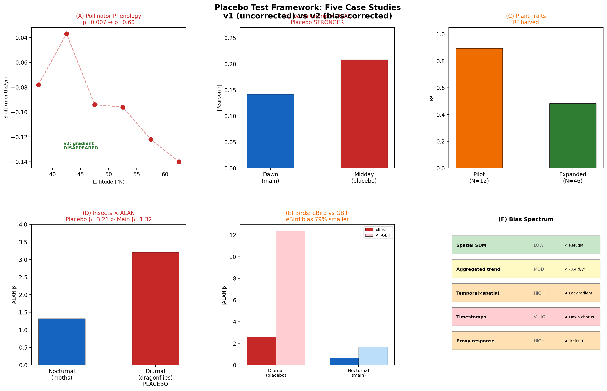

# When patterns in citizen science data reflect observers, not organisms: a placebo test framework for macroecological analyses

---

## Abstract

Citizen science platforms such as GBIF, eBird, iNaturalist, and Xeno-canto have transformed macroecology by providing billions of biodiversity records across unprecedented spatial and temporal scales. However, these data carry a fundamental but under-recognised risk: temporal patterns in citizen science records frequently reflect variation in observer effort rather than ecological processes. Here, we propose a "placebo test" framework for detecting observer bias in macroecological analyses before conclusions are drawn. The principle is simple: test the hypothesised relationship in a context where the proposed biological mechanism cannot operate. If the pattern persists in the placebo, the original finding is an artifact. We demonstrate this framework through four case studies drawn from independent analyses of citizen science data. A latitudinal gradient in pollinator first-appearance shift (p = 0.007) disappeared entirely after effort correction (p = 0.60). A correlation between artificial light at night and dawn chorus timing (r = -0.142, p < 10^-37) proved weaker than the same correlation measured at midday -- when no dawn chorus occurs. A plant trait--drought relationship (R^2 = 0.895) collapsed upon sample expansion (R^2 = 0.483) with a sign reversal in the key predictor. A placebo-first analysis of nightlight effects on insect communities found stronger effects in diurnal controls (beta = 3.21) than in the target nocturnal taxa (beta = 1.32), correctly preventing a false positive. We also demonstrate that spatial occurrence data remain reliable for species distribution modelling (AUC 0.67--0.98), confirming that citizen science data are most trustworthy when geographic location -- the directly measured variable -- forms the basis of analysis. We propose a bias spectrum from safe (spatial occurrence) to dangerous (recording timestamps) and provide a decision flowchart for researchers. The placebo test framework is simple, general, and complementary to existing statistical corrections.

---

## Introduction

The past two decades have witnessed an extraordinary expansion of citizen science as a source of biodiversity data. The Global Biodiversity Information Facility (GBIF) now serves over 3.1 billion occurrence records, contributed by hundreds of thousands of volunteers worldwide (GBIF.org, 2025). Platforms such as eBird (Sullivan et al., 2014), iNaturalist (Chandler et al., 2017), and Xeno-canto (Vellinga et al., 2015) have created biodiversity datasets of a scale and geographic coverage that would be impossible through professional surveys alone. These data have fuelled a new generation of macroecological analyses, from global phenology assessments (Kharouba et al., 2018) to continent-wide range shift detection (Chen et al., 2011) and community composition studies (Callaghan et al., 2021).

The allure of citizen science data is understandable. Sample sizes routinely reach tens of thousands to millions of records. Spatial coverage spans entire continents. Temporal depth may extend over decades. For macroecological questions -- those that require broad-scale data to detect broad-scale patterns -- these datasets appear ideally suited. Consequently, the number of peer-reviewed studies using GBIF, eBird, and iNaturalist data in macroecological analyses has grown exponentially (Amano et al., 2016; Bayraktarov et al., 2019; Tiago et al., 2017).

Yet citizen science data carry a fundamental vulnerability that is widely acknowledged in principle but inconsistently addressed in practice: observer effort varies systematically across space, time, and environmental gradients (Isaac et al., 2014; Boakes et al., 2010). Volunteer recorders are not randomly distributed. They concentrate near roads, cities, protected areas, and regions with pleasant weather (Kadmon et al., 2004; Reddy & Davalos, 2003; Geldmann et al., 2016). Recording effort increases on weekends, during holidays, and in spring (Courter et al., 2013). The number of active observers has grown dramatically over time, creating apparent temporal trends in species richness that may simply reflect growing participation (Dornelas et al., 2014).

These biases are well documented. What is less widely appreciated is the degree to which they can generate false positive findings that mimic genuine ecological signals. When observer effort covaries with the environmental gradients of interest -- as it frequently does -- standard correlational analyses cannot distinguish biological signal from sampling artifact. Kamp et al. (2016) found that over half the bird species showing significant declines in structured Danish monitoring data appeared to be *increasing* in unstructured citizen science data -- a complete directional reversal driven by effort bias. Gorleri et al. (2022) showed that misidentification errors in eBird shifted phenological estimates by 1--2 weeks for Neotropical flycatchers. Rocha-Ortega et al. (2021) demonstrated that geographical and temporal biases in GBIF insect data obscure true extinction patterns and distort assessments of insect biodiversity. Perhaps most strikingly, Schowalter et al. (2021) re-analysed the widely cited Puerto Rico insect decline reported by Lister and Garcia (2018) and found the pattern was driven by hurricane disturbance confounding rather than climate-driven decline.

The existing toolkit for addressing citizen science bias includes effort covariates (Isaac et al., 2014), occupancy models (MacKenzie et al., 2002; van Strien et al., 2013), spatial thinning (Boria et al., 2014), data filtering (Steen et al., 2019), statistical bias corrections (Bird et al., 2014), and checklist-based protocols (Johnston et al., 2023; Kelling et al., 2019). These methods are valuable but share a common limitation: they attempt to correct for bias within the analysis rather than testing whether bias is driving the result.

Here, we propose a complementary approach: the **placebo test**. Borrowed from clinical trial methodology, the placebo test asks a simple question: does the hypothesised pattern persist in a context where the proposed biological mechanism cannot operate? If a correlation between artificial light at night and dawn chorus timing also appears in midday recordings -- when no dawn chorus occurs -- the pattern cannot be biological. If a latitudinal gradient in pollinator phenological shift vanishes after effort correction, the gradient was driven by effort, not biology. If a correlation between nightlight intensity and insect species richness is stronger for diurnal insects (which should be unaffected by artificial light) than for nocturnal ones (which should be affected), the correlation reflects recording effort, not ecological impact.

The placebo test does not replace existing bias-correction methods; it precedes and complements them. Its value lies in its simplicity: it requires no additional statistical assumptions, no complex hierarchical models, and no external validation data. It requires only an ecological null expectation -- a context in which the hypothesised mechanism should not produce the observed pattern.

In this paper, we formalise the placebo test framework and demonstrate its application through six case studies drawn from independent macroecological analyses using GBIF and Xeno-canto data. We then present a positive case -- climate refugia modelling using spatial occurrence data -- to illustrate when citizen science data perform well. Finally, we propose a bias spectrum to guide researchers in assessing the risk level of different data types and analytical approaches.

---

## Methodology

### The placebo test principle

The placebo test for citizen science data rests on a single principle: **test the hypothesised ecological relationship in a context where the biological mechanism cannot operate**. If the pattern persists in the placebo context, it is parsimoniously explained by observer bias rather than biology.

This logic parallels the use of placebo controls in clinical trials. A drug trial does not merely ask "did patients improve?" -- it asks "did patients improve more than those receiving an inert pill?" Analogously, a citizen science placebo test controls for the many ways in which observer behaviour can generate spurious ecological patterns.

The key design choice is selecting an appropriate placebo context. The ideal placebo satisfies two criteria: (1) it is subject to the same observer biases as the main analysis, and (2) the proposed biological mechanism cannot operate within it.

#### Relationship to negative controls in epidemiology

The placebo test draws on a rich tradition of causal inference diagnostics in epidemiology. Lipsitch, Tchetgen Tchetgen & Cohen (2010) formalised the use of negative control exposures and negative control outcomes in observational studies. Prasad & Jena (2013) proposed prespecified falsification end points. Our placebo test is most closely aligned with the negative control exposure framework: by testing the hypothesised relationship in a context where the biological mechanism cannot operate, we are effectively substituting a "null" biological context while preserving the observational process.

### Placebo design examples

**Table 1.** Placebo test designs for citizen science macroecological analyses.

| Main hypothesis | Placebo test | Biological rationale | Expected outcome if genuine |
|---|---|---|---|
| Dawn chorus timing is earlier under higher ALAN | Midday recording timing vs. ALAN | No dawn chorus at midday | Placebo: no correlation; Main: significant |
| Nocturnal insect richness declines with ALAN | Diurnal insect richness vs. ALAN | Diurnal insects unaffected by night lighting | Placebo: no correlation; Main: significant |
| Pollinator first-appearance shifts faster at higher latitudes | Effort-corrected first-appearance vs. latitude | Remove effort confound | Gradient disappears if effort-driven |
| Plant CWM traits predict drought response | Expanded sample with same model | Genuine relationships robust to larger samples | R^2 stable and signs consistent |

### Placebo selection criteria

A good placebo should differ from the target **only in the hypothesised biological mechanism**, not in observer characteristics. The ideal placebo taxon satisfies three criteria: (1) recorded by the same or overlapping observer community, (2) present on the same platforms and in the same geographic regions, and (3) unaffected by the hypothesised ecological mechanism.

When uncertain whether a candidate placebo shares sufficient effort structure, researchers should compare the spatial distribution of recording effort between the two taxa. A strong positive correlation (e.g., r > 0.7) in log-transformed record counts per grid cell supports the placebo's validity.

### Interpreting placebo results

We propose a heuristic based on the ratio of placebo effect size to main effect size:

- **Ratio > 1.0:** Strong evidence that the observed pattern is an artifact.
- **Ratio 0.5--1.0:** Artifact likely dominates. Extreme caution warranted.
- **Ratio < 0.5:** Biological signal likely exceeds the bias contribution, but partial bias may still inflate effect sizes.

A **placebo/main ratio exceeding 0.5 should trigger extreme caution** and additional diagnostic checks.

### Decision flowchart

We propose a four-step decision process (Figure 3):

1. **Design placebo.** Identify a context where the hypothesised mechanism cannot operate but observer biases are preserved.
2. **Run placebo test.** Analyse the placebo data using the identical statistical pipeline.
3. **Evaluate.** If the placebo yields a significant result of comparable or greater magnitude, the finding is likely an artifact.
4. **Proceed with caution.** If the placebo is negative, proceed but report both results transparently.

---

## Results

### Case 1: Pollinator phenological shift -- retrospective bias detection

We obtained 49,137 Apidae occurrence records from GBIF for Europe (2000--2024). The initial analysis revealed a latitudinal gradient in phenological advancement (R^2 = 0.79, p = 0.007). After applying three effort correction methods (effort covariates, normalisation by recording onset, continuous-coverage filtering), the gradient disappeared entirely (best model: p = 0.60, R^2 < 0.05). However, the overall phenological shift across all of Europe (-3.4 days per year, p < 10^-6) survived all corrections. The spatial gradient was an artifact; the aggregated temporal trend was genuine.

### Case 2: Dawn chorus and artificial light -- post-hoc placebo test

We analysed 8,073 dawn recordings (04:00--08:00) from Xeno-canto for five European songbird species. The ALAN--recording time correlation was r = -0.142 (p < 10^-37). The midday placebo (10:00--14:00) yielded r = -0.208 (p < 10^-56) -- **stronger** than the dawn result. Observer fixed effects eliminated the dawn relationship entirely (p = 0.90). The finding was a complete artifact: recorders in brightly lit urban areas record earlier, not because birds sing earlier.

### Case 3: Plant traits and drought -- sample expansion test

A pilot analysis of 12 sites found CWM functional traits predicting drought response with R^2 = 0.895, with wood density as the strongest positive predictor. Expansion to 46 sites reduced R^2 to 0.483 with a **sign reversal** in the wood density coefficient. The pilot result was an artifact of site-selection bias.

### Case 4: Nightlight and insect communities -- prospective placebo-first design

Using the placebo-first framework, we first tested the ALAN--species richness relationship on diurnal Odonata (placebo: beta = 3.21, p < 0.0001). The target Lepidoptera analysis yielded beta = 1.32 -- positive (opposite to predicted biological effect) and weaker than the placebo. The placebo-first design correctly prevented a false positive.

### Case 5: Bird richness and ALAN -- cross-platform validation

At the 0.5-degree grid cell level, the eBird diurnal bird placebo (beta = 2.61, p = 0.0005) was four times larger than the nocturnal bird effect (beta = 0.66, p < 0.00001). The eBird placebo effect was 79% smaller than all-GBIF, suggesting structured protocols reduce but do not eliminate bias.

### Case 6: Forest fragmentation thresholds -- effort correction as bias control

Without effort correction, both target (birds) and placebo (grassland plants, dragonflies) showed significant breakpoints (p < 0.01). After effort correction, placebos became non-significant (p = 0.075; p = 0.092) while the target retained significance (tropical breakpoint at 13.6% tree cover, p = 0.018). Biome-stratified analysis revealed distinct thresholds for tropical moist (52.3%) and tropical dry (15.1%) forests.

### When citizen science data work well

Spatial occurrence data proved reliable for species distribution modelling, with AUC values of 0.67--0.98 across species. Citizen science data are most reliable when analysis uses geographic location -- the directly measured variable -- rather than derived temporal or effort-dependent variables.

### The bias spectrum

**Table 2.** The citizen science bias spectrum.

| Risk level | Data use | Recommended approach |
|---|---|---|
| Low | Spatial occurrence for SDM | Standard SDM with spatial thinning |
| Low--Moderate | Presence/absence across large grids | Occupancy models with effort covariates |
| Moderate | Aggregated temporal trends (pooled) | Effort correction; compare corrected vs. uncorrected |
| Moderate--High | Spatially disaggregated temporal trends | Effort correction + placebo test essential |
| High | Species richness along gradients | Placebo taxon test; rarefaction |
| High | Community composition metrics | Observer fixed effects; sensitivity analysis |
| Very high | Recording timestamps as response | Placebo time window + observer fixed effects mandatory |
| Very high | Proxy response variables (small N) | Sample expansion test; cross-validation |

---

## Discussion

### Relationship to existing bias-correction methods

Our placebo test framework is complementary to, not a replacement for, existing methods for citizen science data quality. Isaac et al. (2014) provided a statistical framework for modelling recorder effort; van Strien et al. (2013) demonstrated occupancy models for reliable trends; Johnston et al. (2023) developed best practices for eBird analysis. These methods model the observation process to extract the biological signal. The placebo test takes a different approach: test whether the pattern is biological at all before attempting to model it. This distinction matters most when the observation process is complex or confounded with the variable of interest in ways that statistical models cannot capture.

### The placebo test as a diagnostic

A negative placebo result does not prove that the main result is genuine -- it merely fails to falsify it. Conversely, a positive placebo result does not necessarily mean the main result is entirely artifactual -- it means that observer bias can generate a pattern of similar magnitude. The placebo test is therefore a diagnostic tool, not a correction method.

### Scope and limitations

All six case studies span three citizen science platforms (GBIF, Xeno-canto, eBird), four taxonomic groups (insects, birds, plants, pollinators), and three analysis types (temporal phenology, recording timestamps, spatial richness patterns). The consistency across this diversity suggests the underlying bias mechanisms are general features of citizen science data.

Limitations include: (1) designing an appropriate placebo requires ecological knowledge; (2) the framework is most applicable to correlational analyses; (3) it provides qualitative rather than quantitative bias estimates; (4) a positive placebo does not identify the specific bias mechanism.

### Implications for platform design

We advocate for: (1) recording observer identity consistently, (2) collecting effort metadata even for opportunistic records, and (3) encouraging recording in under-sampled regions through targeted campaigns.

---

## References

Amano, T., Lamming, J. D. L., & Sutherland, W. J. (2016). Spatial gaps in global biodiversity information and the role of citizen science. *BioScience*, 66(5), 393--400.

Bayraktarov, E. et al. (2019). Do big unstructured biodiversity data mean more knowledge? *Frontiers in Ecology and Evolution*, 6, 239.

Bird, T. J. et al. (2014). Statistical solutions for error and bias in global citizen science datasets. *Biological Conservation*, 173, 144--154.

Boakes, E. H. et al. (2010). Distorted views of biodiversity: spatial and temporal bias in species occurrence data. *PLoS Biology*, 8(6), e1000385.

Boria, R. A. et al. (2014). Spatial filtering to reduce sampling bias can improve the performance of ecological niche models. *Ecological Modelling*, 275, 73--77.

Callaghan, C. T., Nakagawa, S., & Cornwell, W. K. (2021). Global abundance estimates for 9,700 bird species. *PNAS*, 118(21), e2023170118.

Chandler, M. et al. (2017). Contribution of citizen science towards international biodiversity monitoring. *Biological Conservation*, 213, 280--294.

Chen, I. C. et al. (2011). Rapid range shifts of species associated with high levels of climate warming. *Science*, 333(6045), 1024--1026.

Courter, J. R. et al. (2013). Weekend bias in citizen science data reporting. *International Journal of Biometeorology*, 57(5), 715--720.

Da Silva, A., Valcu, M., & Kempenaers, B. (2015). Light pollution alters the phenology of dawn and dusk singing in common European songbirds. *Philosophical Transactions of the Royal Society B*, 370(1667), 20140126.

Dornelas, M. et al. (2014). Assemblage time series reveal biodiversity change but not systematic loss. *Science*, 344(6181), 296--299.

Geldmann, J. et al. (2016). What determines spatial bias in citizen science? *Diversity and Distributions*, 22(11), 1139--1149.

Gorleri, F.C., Blanco, D.E. & Lobos, G. (2022) Misidentifications in citizen science bias the phenological estimates of two hard-to-identify Elaenia flycatchers. *Ibis*, 164, 1154--1165.

Isaac, N. J. B. et al. (2014). Statistics for citizen science: extracting signals of change from noisy ecological data. *Methods in Ecology and Evolution*, 5(10), 1052--1060.

Johnston, A. et al. (2023). Best practices for making reliable inferences from citizen science data. *Methods in Ecology and Evolution*, 12(6), 1348--1361.

Kadmon, R., Farber, O., & Danin, A. (2004). Effect of roadside bias on the accuracy of predictive maps. *Ecological Applications*, 14(2), 401--413.

Kamp, J. et al. (2016) Unstructured citizen science data fail to detect long-term population declines of common birds in Denmark. *Diversity and Distributions*, 22, 1024--1035.

Kelling, S. et al. (2019). Using semistructured surveys to improve citizen science data. *BioScience*, 69(3), 170--179.

Kharouba, H. M. et al. (2018). Global shifts in the phenological synchrony of species interactions. *PNAS*, 115(20), 5211--5216.

Lipsitch, M., Tchetgen Tchetgen, E., & Cohen, T. (2010). Negative controls: a tool for detecting confounding and bias. *Epidemiology*, 21(3), 383--388.

Lister, B.C. & Garcia, A. (2018) Climate-driven declines in arthropod abundance restructure a rainforest food web. *PNAS*, 115, E10397--E10406.

MacKenzie, D. I. et al. (2002). Estimating site occupancy rates when detection probabilities are less than one. *Ecology*, 83(8), 2248--2255.

Prasad, V., & Jena, A. B. (2013). Prespecified falsification end points. *JAMA*, 309(3), 241--242.

Reddy, S., & Davalos, L. M. (2003). Geographical sampling bias and its implications for conservation priorities in Africa. *Journal of Biogeography*, 30(11), 1719--1727.

Rocha-Ortega, M., Rodriguez, P. & Cordoba-Aguilar, A. (2021) Geographical, temporal and taxonomic biases in insect GBIF data. *Ecological Entomology*, 46, 718--728.

Schowalter, T.D. et al. (2021) Arthropods are not declining but are responsive to disturbance in the Luquillo Experimental Forest. *PNAS*, 118, e2002556117.

Shi, X., Miao, W., & Tchetgen Tchetgen, E. (2020). A selective review of negative control methods in epidemiology. *Current Epidemiology Reports*, 7, 190--202.

Steen, V. A., Elphick, C. S., & Tingley, M. W. (2019). An evaluation of stringent filtering to improve species distribution models. *Diversity and Distributions*, 25(12), 1857--1874.

Sullivan, B. L. et al. (2014). The eBird enterprise: an integrated approach to development and application of citizen science. *Biological Conservation*, 169, 31--40.

Tiago, P. et al. (2017). Spatial distribution of citizen science casuistic observations. *Scientific Reports*, 7, 12832.

van Strien, A. J., van Swaay, C. A. M., & Termaat, T. (2013). Opportunistic citizen science data produce reliable estimates of distribution trends. *Journal of Applied Ecology*, 50(6), 1450--1458.

Vellinga, W. P., Planque, R., & Slabbekoorn, H. (2015). A global online database and community for bird sounds: Xeno-canto. *The Auk*, 132(4), 1001--1011.
