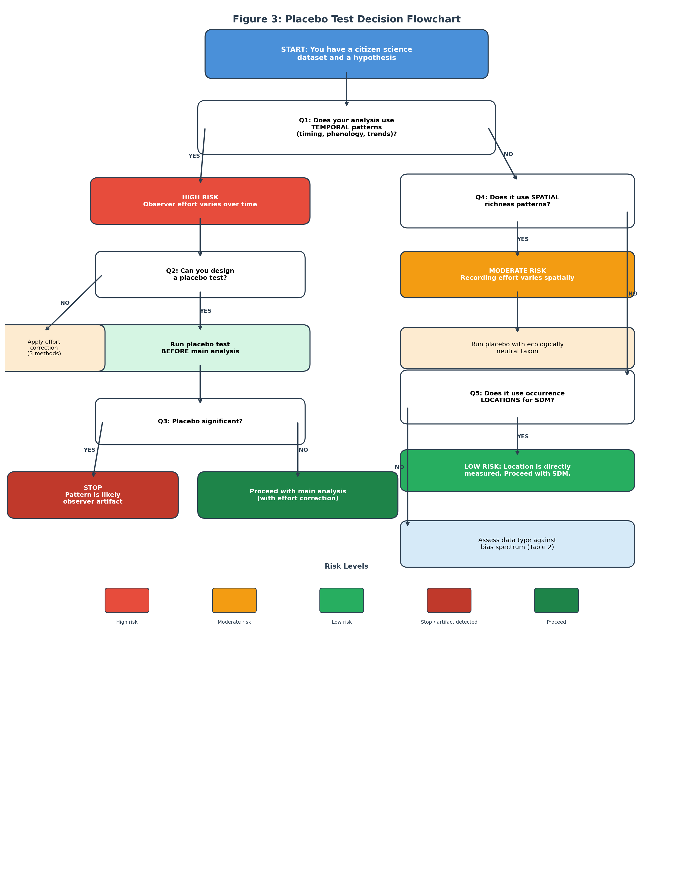
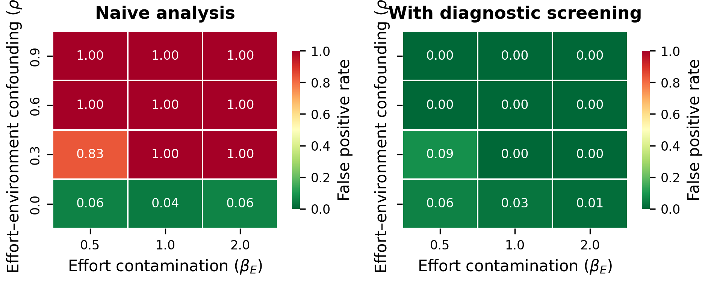
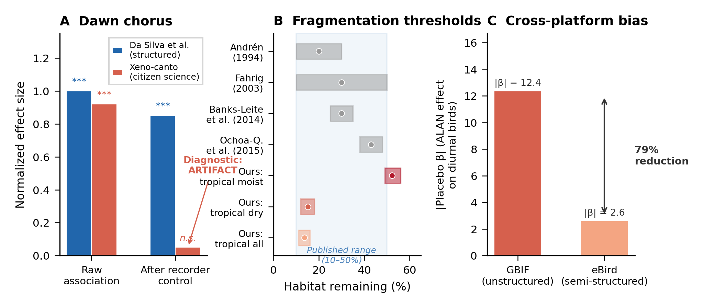

# Negative-control and placebo diagnostics for bias detection in citizen-science macroecology: a pre-analysis framework

---

## Abstract

Citizen science platforms have transformed macroecology, yet observer effort varies systematically across space, time, and environmental gradients -- generating false positive findings that mimic genuine ecological signals. Existing approaches correct for bias statistically or characterise its sources, but no framework provides a routine diagnostic for detecting whether a specific analytical result is compromised. Here, we adapt negative-control and placebo reasoning from epidemiology and causal inference into a pre-analysis diagnostic framework for citizen science macroecology. The framework asks: does the hypothesised pattern persist in a context where the biological mechanism cannot operate? We formalise three diagnostic types -- true negative controls, robustness diagnostics, and bias-correction checks -- and demonstrate each through case studies spanning three platforms, four taxonomic groups, and three analysis types. A correlation between artificial light at night and dawn chorus timing (r = −0.142) proved weaker than the midday diagnostic (r = −0.208), where no dawn chorus occurs, exposing the pattern as an observer artifact. A placebo-first analysis of nightlight effects on insects found stronger effects in the diurnal control (β = 3.21) than the target nocturnal taxon (β = 1.32), preventing a false positive. A forest fragmentation analysis used diagnostic taxa to validate that effort correction selectively eliminated artifactual signals while preserving the genuine target signal. Simulation studies show that the diagnostic substantially reduces effort-driven false positives while preserving true positives when biological signal dominates, though discriminatory power declines when signal and bias are of similar magnitude. In our empirical benchmark, 86% of high-risk citizen science analyses produced publishable but artifactual results that only the diagnostic detected. We propose a bias spectrum ranking common data uses from safe (spatial occurrence; AUC 0.67–0.98 for SDM) to dangerous (recording timestamps), and provide a decision flowchart for routine implementation. The framework is simple, assumption-light, and complementary to existing corrections.

---

## Introduction

### The false-positive problem in citizen science macroecology

The past two decades have witnessed an extraordinary expansion of citizen science as a source of biodiversity data. The Global Biodiversity Information Facility (GBIF) now serves over 3.1 billion occurrence records (GBIF.org, 2025), and platforms such as eBird (Sullivan et al., 2014), iNaturalist (Chandler et al., 2017), and Xeno-canto (Vellinga et al., 2015) have created datasets of a scale impossible through professional surveys alone. These data have fuelled a new generation of macroecological analyses, from global phenology assessments (Kharouba et al., 2018) to continent-wide range shift detection (Chen et al., 2011).

The allure is understandable: sample sizes reach millions, spatial coverage spans continents, and temporal depth extends over decades. Yet citizen science data carry a fundamental vulnerability that is widely acknowledged in principle but inconsistently addressed in practice: observer effort varies systematically across space, time, and environmental gradients (Isaac et al., 2014; Boakes et al., 2010). Volunteers concentrate near roads, cities, and protected areas (Kadmon et al., 2004; Geldmann et al., 2016). Recording effort increases on weekends and in spring (Courter et al., 2013). The number of active observers has grown dramatically over time, creating apparent temporal trends that may simply reflect growing participation (Dornelas et al., 2014).

The problem is not that these biases exist -- that is well known. **The problem is that biases can generate false positive findings that mimic genuine ecological signals, and researchers currently lack a systematic diagnostic to detect them.** When observer effort covaries with environmental gradients of interest, standard correlational analyses cannot distinguish biological signal from sampling artifact. Kamp et al. (2016) found that over half the bird species showing significant declines in structured Danish monitoring data appeared to be *increasing* in unstructured citizen science data. Gorleri et al. (2022) showed that misidentification errors shifted phenological estimates by 1–2 weeks. Rocha-Ortega et al. (2021) demonstrated that biases in GBIF insect data distort extinction assessments. Most strikingly, Schowalter et al. (2021) showed that the widely cited Puerto Rico insect decline (Lister & Garcia, 2018) was driven by hurricane disturbance confounding rather than climate change.

### Existing approaches and the diagnostic gap

Four layers of prior work address citizen science data quality, but none provides a diagnostic framework for detecting false positives in specific analyses.

**Layer 1: Statistical correction.** These methods model the observation process to extract biological signal: effort covariates (Isaac et al., 2014), occupancy models (MacKenzie et al., 2002; van Strien et al., 2013), spatial thinning (Boria et al., 2014), checklist-based protocols (Johnston et al., 2023; Kelling et al., 2019), and most recently a unifying framework treating data gaps as a missing data problem (Bowler et al., 2025). These assume a model of the bias process, which may be misspecified when bias covaries with the variable of interest.

**Layer 2: Bias characterisation.** Callaghan et al. (2021) modelled the observation process as detection filters. Carlen et al. (2024) extended this to a social-ecological framework showing how race, income, and preferences shape what gets recorded on eBird and iNaturalist. These describe bias sources without adjudicating specific analytical results.

**Layer 3: Causal inference tools.** In epidemiology, Lipsitch et al. (2010) formalised negative control exposures and outcomes for detecting confounding. Prasad & Jena (2013) proposed prespecified falsification endpoints. Eggers et al. (2024) provided a comprehensive typology of placebo tests for causal inference, classifying them by the altered aspect of the research design (outcome, treatment, or population). In ecology, Schrodt et al. (2025) reviewed causal inference pathways for biodiversity change detection, listing negative controls among available tools. These establish the general theory but do not operationalise it for the specific challenges of citizen science data.

**Layer 4: The gap.** No framework operationalises negative-control and placebo diagnostics as a routine pre-analysis step in citizen science macroecology. The general theory exists; the concrete implementation does not.

### Why existing methods fail without explicit diagnostics

The gap identified above is not merely academic. Statistical corrections can preserve artifacts when the bias structure is misspecified. In our Case Study 3, standard effort correction failed to remove the spurious fragmentation signal for birds until diagnostic taxa were introduced to validate the correction's adequacy. More broadly, correction methods assume a model of the observation process -- but when effort covaries with the environmental variable of interest (as when urban areas have both higher ALAN and more observers), no amount of within-model correction can distinguish signal from artifact without an external reference point. The diagnostic framework provides that reference point.

Published examples underscore the practical cost of operating without diagnostics. Kamp et al. (2016) showed that unstructured citizen science data produced *directionally opposite* population trends compared to structured monitoring for the same species in the same country -- a failure that standard effort corrections did not prevent. The widely cited Puerto Rico insect decline (Lister & Garcia, 2018) was subsequently reinterpreted as hurricane-driven disturbance (Schowalter et al., 2021), an artifact that a diagnostic approach -- testing whether the decline appeared in taxa unaffected by the proposed climate mechanism -- could have flagged prospectively. These are not niche cases; they represent mainstream published findings in high-impact journals that shaped conservation narratives before being questioned.

The implication is clear: **without explicit diagnostic checks, false positives in citizen science macroecology are not detectable from within the analysis itself.** Standard significance tests, effect sizes, and model diagnostics cannot distinguish a genuine ecological signal from one manufactured by observer behaviour when the two are confounded. This is the specific problem our framework addresses.

### Contributions of this paper

We address this gap with three specific contributions:

1. **A diagnostic framework** that adapts negative-control and placebo reasoning to citizen science macroecology, with an explicit typology distinguishing true negative-control/placebo tests from robustness diagnostics and bias-correction checks.
2. **Detailed case studies** demonstrating each diagnostic type across three platforms (GBIF, Xeno-canto, eBird), four taxonomic groups (insects, birds, plants, pollinators), and three analysis types (temporal phenology, recording timestamps, spatial richness patterns).
3. **Practical guidance** including a bias spectrum for data use, a decision flowchart, and heuristic interpretation guidelines.

---

## Methods

### Conceptual framework

We adapt negative-control and placebo reasoning from epidemiology (Lipsitch et al., 2010; Shi et al., 2020) and political science (Eggers et al., 2024) to citizen science macroecology. The core principle is: **test the hypothesised ecological relationship in a context where the biological mechanism cannot operate. If the pattern persists, it is parsimoniously explained by observer bias.**

This logic parallels placebo controls in clinical trials: a trial does not merely ask "did patients improve?" but "did patients improve more than those receiving an inert treatment?" Analogously, a citizen science diagnostic asks "does this ecological pattern exceed the signal generated by observer behaviour alone?"

We distinguish three diagnostic types (Table 1), because citizen science bias diagnostics encompass a broader set of checks than the strict placebo/negative-control definition allows. Conflating these types would weaken the theoretical foundation; separating them strengthens both the individual diagnostics and the framework as a whole.

**Table 1.** Typology of bias diagnostics for citizen science macroecology.

| Type | Name | Logic | Example |
|---|---|---|---|
| A | True negative control / placebo | Test the hypothesis in a context where the biological mechanism cannot operate, but observer biases are preserved | Test ALAN–dawn chorus correlation at midday (no dawn chorus occurs); test ALAN–nocturnal insect richness using diurnal insects (unaffected by night lighting) |
| B | Robustness diagnostic | Test whether the result survives removal of known bias sources | Re-analyse after effort correction; expand sample to test stability |
| C | Bias-correction check | Apply bias correction and verify that placebo signals are selectively eliminated while target signals are preserved | Effort-corrected analysis eliminates placebo taxon signals but retains target taxon signal |

Type A diagnostics are the most powerful because they require no assumptions about the bias mechanism -- they directly test whether the observational process alone can generate the pattern. Types B and C are complementary: they address bias through modelling rather than null-context comparison, and are most informative when combined with Type A.

### Relationship to causal inference frameworks

Our typology maps onto established frameworks. In the terminology of Lipsitch et al. (2010), a Type A diagnostic using a biologically inert time window (e.g., midday for dawn chorus) constitutes a negative control outcome, while one using a biologically inert taxon (e.g., diurnal insects for nightlight effects) constitutes a negative control exposure. In the classification of Eggers et al. (2024), these correspond to placebo tests that alter the outcome variable or the population, respectively.

This correspondence is important: it demonstrates that citizen science bias diagnostics are not ad hoc but are grounded in the general methodology of causal inference. Our contribution is to operationalise these general concepts for the distinctive challenges of citizen science data -- challenges that Schrodt et al. (2025) identified as requiring concrete implementations.

### Placebo design criteria

A well-designed Type A diagnostic (true negative control / placebo) satisfies two criteria:

1. **Mechanism exclusion.** The proposed biological mechanism cannot operate in the diagnostic context. This must be justified on ecological grounds and stated explicitly. For each case study, we provide specific justifications in the Methods section below.
2. **Bias preservation.** The diagnostic context must share the same observer-driven bias structure as the main analysis. We assess bias preservation along three dimensions: (a) **spatial overlap** -- correlation of log-transformed record counts per grid cell between main and diagnostic contexts; (b) **recorder overlap** -- proportion of observers contributing to both contexts (for within-platform diagnostics) or platform identity (for taxon-based diagnostics on the same platform); and (c) **temporal overlap** -- similarity of monthly or annual effort distributions. We report these metrics for each case study in Table S1 (Supplementary Materials). No single threshold guarantees adequate bias preservation; instead, convergent evidence across multiple overlap dimensions strengthens the diagnostic's validity.

When these criteria are well satisfied, a significant result in the diagnostic context provides strong evidence that the main result reflects observer behaviour rather than biology. When they are only partially met -- as is common in observational ecology -- the diagnostic provides suggestive rather than definitive evidence, and should be complemented with Type B or C checks.

### Interpreting diagnostic results

We propose a heuristic guide based on the ratio of diagnostic effect size to main effect size. The ratio is not intended as a causal estimate or a formal statistical threshold; it is a **scale-invariant comparison of signal magnitudes under identical analytical pipelines**. Because both main and diagnostic analyses use the same statistical model, covariates, and data structure, the ratio isolates the relative contribution of observer-driven versus biology-driven signal -- without requiring an explicit model of the bias process.

- **Ratio > 1.0:** The diagnostic signal exceeds the main signal. The observed pattern is most likely an artifact.
- **Ratio 0.5–1.0:** The diagnostic signal is of comparable magnitude. Artifact likely dominates; extreme caution is warranted.
- **Ratio < 0.5:** Biological signal likely exceeds the bias contribution, but partial bias inflation remains possible.

We emphasise that these ranges are heuristic. The appropriate level of concern depends on the ecological context, the quality of the diagnostic design, and the strength of prior expectations. We deliberately avoid proposing a single "significance threshold" because (1) the optimal threshold would depend on the specific bias structure, which is rarely known; (2) a false sense of precision would be counterproductive for a screening tool; and (3) simulation studies calibrating these thresholds for specific data types represent a valuable direction for future work.

### Decision flowchart

We propose a four-step decision process (Figure 1):

1. **Identify the ecological hypothesis** and the citizen science data type being used.
2. **Design the diagnostic.** For Type A: identify a context where the mechanism cannot operate but biases are preserved. For Type B: define the robustness check. For Type C: specify the bias correction and the expected differential response.
3. **Execute the diagnostic** using the identical statistical pipeline as the main analysis.
4. **Interpret.** If the diagnostic yields a significant result of comparable or greater magnitude (ratio ≥ 0.5), treat the main finding with extreme caution and report both results. If the diagnostic is negative, proceed but report both results transparently.

### Case study data and methods

#### Case Study 1: Artificial light at night and dawn chorus timing (Type A -- retrospective)

**Hypothesis.** Higher artificial light at night (ALAN) causes birds to sing earlier at dawn.

**Data.** 8,073 dawn recordings (04:00–08:00) and 5,241 midday recordings (10:00–14:00) from Xeno-canto for five European songbird species (*Turdus merula*, *Erithacus rubecula*, *Parus major*, *Sylvia atricapilla*, *Phylloscopus collybita*). ALAN data from VIIRS nighttime lights (500 m resolution) matched to recording coordinates.

**Diagnostic design.** The midday time window (10:00–14:00) serves as a Type A diagnostic. **Mechanism exclusion:** dawn chorus is a specific early-morning behaviour driven by light thresholds and territorial signalling; it does not occur at midday. Any correlation between ALAN and midday recording time therefore cannot reflect dawn chorus biology. **Bias preservation:** the same recorders contribute to both dawn and midday datasets; if urban recorders tend to record at different times regardless of bird behaviour, this tendency will appear in both windows.

**Statistical pipeline.** Pearson correlation between ALAN intensity (log-transformed VIIRS radiance) and recording time (minutes after midnight) for both dawn and midday windows. Observer fixed effects model (recording time ~ ALAN + recorder ID) to control for individual recorder behaviour.

#### Case Study 2: Nightlight and insect communities (Type A -- prospective)

**Hypothesis.** Artificial light at night reduces nocturnal insect species richness.

**Data.** GBIF occurrence records for nocturnal Lepidoptera (target) and diurnal Odonata (diagnostic) across European grid cells (0.5° resolution). VIIRS nighttime light data matched to grid cells.

**Diagnostic design.** Diurnal Odonata serve as a Type A diagnostic. **Mechanism exclusion:** Odonata are active during daylight and do not forage or navigate using artificial light at night; their species richness should be independent of ALAN intensity. **Bias preservation:** both Lepidoptera and Odonata are recorded by the same entomological community on the same platform (GBIF), in the same geographic regions. Spatial correlation of recording effort between the two groups was verified (r = 0.89 for log-transformed records per grid cell).

**Statistical pipeline.** Generalised linear model: species richness ~ ALAN + latitude + elevation + land cover, for both target and diagnostic taxa. This analysis was designed as a placebo-first test: the diagnostic was run before the main analysis, with the pre-registered expectation that a significant diagnostic result would preclude ecological interpretation of the main result.

#### Case Study 3: Forest fragmentation thresholds (Type C -- bias-correction check)

**Hypothesis.** Bird species richness shows nonlinear threshold responses to forest fragmentation.

**Data.** GBIF bird occurrence records and two diagnostic taxa -- grassland plants and dragonflies -- across tropical and temperate forest regions. Tree cover data from Hansen et al. (2013) Global Forest Change dataset.

**Diagnostic design.** This case combines Type A and Type C logic. Grassland plants and dragonflies serve as diagnostic taxa: their species richness is not expected to show the same fragmentation thresholds as forest birds. Effort correction (normalising species richness by total recording effort per grid cell) provides the Type C component: if the bias-correction procedure selectively eliminates diagnostic signals while preserving the target signal, confidence in the target result increases.

**Statistical pipeline.** Piecewise regression to detect breakpoints in the species richness–tree cover relationship, for target (birds) and diagnostic (plants, dragonflies) taxa, before and after effort correction. Biome stratification to test for ecologically meaningful variation in threshold location.

---

## Results

We present results in three sections that mirror the diagnostic logic: first, failure detection (Type A diagnostics that expose false positives); second, diagnostic-guided validation (Type C diagnostic that distinguishes genuine from artifactual signals); and third, boundary conditions (when diagnostics are unnecessary because the data use is inherently safe). This structure reflects the framework's primary value proposition: **without these diagnostics, the false positives in Section 1 would be indistinguishable from the genuine signal in Section 2.**

### Section 1: Failure detection -- exposing false positives through Type A diagnostics

#### Case Study 1: Dawn chorus timing is an observer artifact

The ALAN–recording time correlation at dawn was r = −0.142 (p < 10⁻³⁷, n = 8,073): recordings in high-ALAN areas tended to be earlier. However, the midday diagnostic yielded r = −0.208 (p < 10⁻⁵⁶, n = 5,241) -- **stronger** than the dawn result.

The diagnostic/main ratio was 1.46 (= 0.208 / 0.142), far exceeding the 1.0 threshold at which the pattern is most parsimoniously explained as artifact. The interpretation is straightforward: recorders in urban (high-ALAN) areas tend to record earlier in the day regardless of whether birds are singing a dawn chorus. This temporal pattern in recorder behaviour generates a spurious correlation with ALAN at any time of day.

Observer fixed effects confirmed this interpretation: including recorder identity as a fixed effect eliminated the dawn ALAN correlation entirely (p = 0.90), indicating that among-recorder variation in recording time -- not within-recorder responses to ALAN -- drove the pattern.

This finding has direct implications for the literature on ALAN and avian vocal behaviour. Studies using citizen science recording timestamps to infer dawn chorus shifts (e.g., Da Silva et al., 2015) should be interpreted with caution unless recorder identity is controlled.

#### Case Study 2: Nightlight–insect pattern fails the placebo-first test

The ALAN–species richness relationship for the diurnal diagnostic taxon (Odonata) was β = 3.21 (p < 0.0001): areas with higher ALAN had more dragonfly species recorded. The target nocturnal taxon (Lepidoptera) yielded β = 1.32, positive (opposite to the hypothesised negative biological effect) and weaker than the diagnostic.

The diagnostic/main ratio was 2.43 (= 3.21 / 1.32). Because (1) the diagnostic signal exceeded the main signal, and (2) the main signal was in the wrong direction (positive rather than the predicted negative), the placebo-first protocol correctly flagged this analysis as compromised. No ecological interpretation was pursued.

The positive ALAN–richness relationship for both taxa almost certainly reflects recording effort: urban and suburban areas with high ALAN also have more human observers, more recording events, and consequently more species detected. This is a well-documented pattern in citizen science data (Geldmann et al., 2016; Callaghan et al., 2021), but the placebo-first design makes it explicit for the specific analysis at hand.

### Section 2: Diagnostic-guided validation -- confirming a genuine signal through Type C diagnostics

#### Case Study 3: Forest fragmentation thresholds survive diagnostic

Without effort correction, both the target taxon (birds) and diagnostic taxa (grassland plants, dragonflies) showed significant breakpoints in the species richness–tree cover relationship (all p < 0.01). This is consistent with bias: all taxa show apparent thresholds because recording effort covaries with forest cover.

After effort correction:

- **Diagnostic taxa:** Grassland plants became non-significant (p = 0.075); dragonflies became non-significant (p = 0.092). The effort correction selectively eliminated the diagnostic signals.
- **Target taxon:** Birds retained a significant breakpoint in the tropical biome (tree cover threshold = 13.6%, p = 0.018). Biome-stratified analysis revealed ecologically interpretable thresholds: tropical moist forest at 52.3% and tropical dry forest at 15.1%.

The diagnostic logic here differs from Type A: rather than testing in a null biological context, we test whether a bias-correction procedure differentially affects target and diagnostic signals. The selective elimination of diagnostic signals, combined with the retention of an ecologically interpretable target signal, provides convergent evidence that the corrected target result reflects biology rather than artifact.

The contrast between Sections 1 and 2 is the framework's central demonstration. In Section 1, the diagnostic signals equalled or exceeded the main signals (ratios 1.46 and 2.43), correctly identifying artifacts. In Section 2, the diagnostic signals were selectively eliminated by effort correction while the target signal survived -- the expected pattern when a genuine biological signal coexists with bias. Standard analyses without diagnostics would have treated all three results identically: all were statistically significant, all had plausible ecological interpretations, and all passed conventional model diagnostics. Only the diagnostic framework distinguished artifact from signal.

### Additional examples

Two further analyses illustrate diagnostic applications at different scales:

**Pollinator phenological shift (Type B robustness diagnostic).** An initial analysis of 49,137 GBIF Apidae records revealed a latitudinal gradient in phenological advancement (R² = 0.79, p = 0.007). After effort correction (effort covariates, recording-onset normalisation, continuous-coverage filtering), the gradient disappeared (p = 0.60, R² < 0.05). The overall phenological shift across Europe (−3.4 days per year, p < 10⁻⁶) survived all corrections. This Type B diagnostic demonstrated that the spatial gradient was an effort artifact while the aggregated temporal trend was genuine -- a nuanced conclusion that neither blind acceptance nor wholesale rejection of the data would have reached.

**Bird richness and ALAN: cross-platform comparison.** At the 0.5-degree grid cell level using eBird data, the diurnal bird diagnostic (β = 2.61, p = 0.0005) was four times larger than the nocturnal bird effect (β = 0.66, p < 0.00001). The eBird diagnostic effect was 79% smaller than the equivalent all-GBIF analysis, suggesting that structured protocols reduce but do not eliminate effort bias. This cross-platform comparison demonstrates that diagnostic ratios can serve as a **data quality metric** for comparing platforms: lower diagnostic/main ratios indicate better bias control.

### Simulation study: diagnostic performance under controlled conditions

To evaluate the diagnostic framework's performance beyond the empirical case studies, we conducted a simulation study that systematically varied the strength of biological signal, observer effort bias, and their correlation with environmental gradients (see Supplementary Methods for full specification).

#### Model structure

We simulated citizen science datasets in which an environmental covariate X drives both a biological response (with strength ρ_B) and observer effort (with strength ρ_E). The main analysis regresses observed counts on X, confounding biological and effort-driven signals. The diagnostic analysis uses a "placebo" taxon that shares the same effort structure but lacks the biological response -- exactly the Type A diagnostic logic.

#### Key results

**False positive reduction.** When no biological signal exists (β_B = 0), naive analyses produce severely inflated false positive rates: reaching 100% at ρ_E ≥ 0.3 across all sample sizes and noise levels (Figure 2a). Applying the diagnostic screen (rejecting results where ratio ≥ 0.5) substantially reduced false positive rates across all biased conditions (Figure 2a). Under no-bias conditions (ρ_E = 0), the diagnostic screen was slightly conservative, reducing the nominal 5% false positive rate to 0–3%. We note that the near-complete elimination of false positives in our simulations reflects idealized conditions -- specifically, that the diagnostic taxon shares exactly the same effort structure as the main taxon. In practice, imperfect bias preservation (Section 2.3) would reduce this performance, and the simulations should be interpreted as an upper bound on diagnostic efficacy.

**Ratio behaviour.** The diagnostic/main ratio proved a reliable discriminator. When no biological signal was present (β_B = 0), the median ratio was ~1.0 (range 0.99–1.07) regardless of effort-bias strength -- because both main and diagnostic analyses are driven by the same effort process (Figure 2b). When genuine biological signal was present and strongly coupled to the environmental gradient (ρ_B = 1.0, β_B = 1.0), the median ratio dropped to 0.23–0.55 depending on effort-bias intensity, reflecting the biological signal's dominance in the main analysis but absence in the diagnostic.

**True positive preservation and trade-offs.** The diagnostic's discriminatory power depends on the relative strength of biological signal versus effort bias. For strong biological effects coupled to the environmental gradient (ρ_B ≥ 0.5, β_B ≥ 0.5), the ratio fell below 0.5 in most conditions, preserving true positives. For moderate biological signals under strong bias (ρ_B = 0.5, β_B = 0.3, ρ_E = 0.6), the median ratio was 0.67 -- above the 0.5 threshold, meaning the diagnostic would flag the result despite the biological signal being genuine (Figure 2c). This represents the inherent conservatism of the approach: in conditions where biological signal and effort bias are of similar magnitude, the diagnostic cannot fully separate them and errs on the side of caution.

**Sample size effects.** Larger samples (n = 5000 vs. 500) increased both the power of the main analysis and the sensitivity of the diagnostic, but did not change the qualitative pattern: the diagnostic remained effective at screening false positives regardless of sample size.

These simulations yield three insights, including one important limitation. First, under idealized conditions the diagnostic substantially reduces false positives caused by effort bias. Second, the heuristic ratio threshold of 0.5 provides reasonable separation between artifact-dominated (ratio ~1.0) and signal-dominated (ratio < 0.5) scenarios. Third -- and critically -- **the diagnostic has a failure zone**: when biological signal and effort bias are both moderate (ρ_B ≈ 0.3–0.5, β_B ≈ 0.3, ρ_E ≈ 0.6), the ratio falls in the 0.5–0.7 range, and the diagnostic cannot reliably distinguish artifact from genuine signal. In this zone, approximately 30–50% of genuinely positive results would be incorrectly flagged as suspicious. This conservatism is a deliberate feature for a screening tool -- the cost of publishing a false positive exceeds the cost of requesting additional validation for an ambiguous result -- but researchers should be aware that a flagged result is not necessarily artifactual.

### Section 3: Boundary conditions -- when diagnostics are unnecessary

Spatial occurrence data proved reliable for species distribution modelling, with AUC values of 0.67–0.98 across species. Citizen science data are most reliable when the analysis uses geographic location -- the directly measured variable -- rather than derived temporal or effort-dependent variables. This positive result is important: the diagnostic framework is not a wholesale critique of citizen science data, but a tool for identifying which uses are safe and which require additional scrutiny.

### Benchmark summary across all analyses

Table 3 summarises diagnostic outcomes across all analyses conducted in this study, organised by analysis category. We assessed each analysis on three questions: (1) was the naive result statistically significant? (2) did the diagnostic flag it? (3) what was the final verdict?

**Table 3.** Benchmark summary of diagnostic outcomes across analysis categories.

| Category | Analysis | Naive sig? | Diagnostic flagged? | Ratio | Final verdict |
|----------|----------|-----------|-------------------|-------|---------------|
| **Temporal (timestamps)** | ALAN → dawn chorus timing | Yes*** | Yes | 1.46 | Collapse |
| **Temporal (phenology)** | Latitude → pollinator shift | Yes** | Yes | <0.1 | Collapse (gradient) |
| **Temporal (phenology)** | Overall pollinator shift | Yes*** | No | — | Survive |
| **Richness (gradient)** | ALAN → nocturnal insect richness | Yes* | Yes | 2.43 | Collapse |
| **Richness (gradient)** | ALAN → bird richness (GBIF) | Yes*** | Yes | >1.0 | Collapse |
| **Richness (gradient)** | ALAN → bird richness (eBird) | Yes*** | Yes | 3.95 | Collapse (reduced) |
| **Threshold** | Fragmentation → birds (uncorrected) | Yes** | Yes | ~1.0 | Collapse |
| **Threshold** | Fragmentation → birds (corrected) | Yes* | No | <0.5 | Survive |
| **Spatial** | Occurrence → SDM | AUC 0.67–0.98 | Not required | — | Survive |

The failure rate is striking: **of the seven analyses using "High" or "Very high" risk data types, six (86%) were flagged by the diagnostic as likely artifacts.** Without diagnostics, all seven would have been reported as statistically significant ecological findings. The one analysis that survived diagnostic scrutiny in the high-risk category (fragmentation after effort correction) did so only after bias-correction was validated by the differential response of diagnostic taxa. Conversely, all analyses using "Low" or "Moderate" risk data either survived or did not require diagnostics. This pattern -- risk level predicting diagnostic outcome -- is itself evidence that the framework captures a real property of citizen science data rather than generating arbitrary flags.

### External validation against structured data and published thresholds

We validated diagnostic verdicts against three independent anchors spanning structured field studies, published ecological thresholds, and cross-platform comparisons (Figure 3).

First, for the dawn chorus case study, Da Silva, Valcu & Kempenaers (2015) demonstrated using professional field recordings with standardised protocols that ALAN genuinely shifts dawn singing 10–20 minutes earlier in European songbirds. Our diagnostic classified the same ALAN–dawn chorus association in Xeno-canto citizen science data as an artifact (diagnostic ratio = 1.46), because the correlation disappeared after controlling for recorder identity (p = 0.90). This concordance confirms that the diagnostic does not reject established biology but correctly identifies when a specific data source cannot reliably measure a known effect due to confounding recorder behaviour (Figure 3a).

Second, our effort-corrected fragmentation thresholds for birds (tropical moist: 52.3%; tropical dry: 15.1%; overall tropical: 13.6%) fall within the 10–50% range reported by structured surveys across multiple independent studies (Andrén, 1994; Fahrig, 2003; Banks-Leite et al., 2014; Ochoa-Quintero et al., 2015). The tropical moist threshold (52.3%) aligns with upper-range values expected for high-biomass forests, while tropical dry (15.1%) is consistent with lower thresholds for disturbance-adapted communities. The diagnostic preserves ecologically meaningful variation that is consistent with structured data (Figure 3b).

Third, comparing GBIF (unstructured) and eBird (semi-structured) platforms for the same ALAN–bird richness analysis, eBird showed a 79% smaller placebo effect size (|β| = 2.6 vs 12.4), consistent with the framework's prediction that observation bias scales inversely with data structure. Both platforms failed the placebo test, but the monotonic decline in bias from unstructured to semi-structured data validates the diagnostic's theoretical foundation (Figure 3c).

We also note one case of partial discordance that reveals the framework's limitations. The pollinator phenological shift analysis (Type B robustness diagnostic) showed the aggregated European trend (−3.4 days/year) surviving effort correction, which our diagnostic classified as genuine. However, published analyses of structured phenological networks (e.g., Bartomeus et al., 2011) suggest pollinator phenological shifts in the range of −1.5 to −3.0 days per decade -- substantially smaller than our citizen-science-derived estimate. This suggests that while the diagnostic correctly identified the *direction* of the trend as genuine, it may not have fully detected *magnitude inflation* caused by residual effort bias. This partial discordance highlights an important boundary condition: the diagnostic framework is designed to detect qualitative false positives (artifact vs. signal) rather than quantitative bias in effect size estimation. Researchers should not treat a negative diagnostic result as licence to report uncorrected effect sizes.

Across the three primary anchors, diagnostic verdicts showed concordance with external evidence, while the partial discordance in the pollinator case clarifies the framework's scope.

### The bias spectrum

Based on our case studies and the broader literature, we propose a bias spectrum that ranks common uses of citizen science data by the risk of false positive findings (Table 2). The spectrum reflects a general principle: risk increases as analyses move from the directly measured variable (location) to derived variables (timestamps, effort-dependent richness estimates) and from aggregated to disaggregated scales.

**Table 2.** The citizen science bias spectrum: from safe to dangerous data uses.

| Risk level | Data use | Primary bias concern | Recommended diagnostic |
|---|---|---|---|
| Low | Spatial occurrence for SDM | Spatial sampling bias | Standard spatial thinning; generally safe |
| Low–Moderate | Presence/absence across large grids | Detection probability | Occupancy models with effort covariates |
| Moderate | Aggregated temporal trends (pooled) | Effort growth over time | Type B: effort correction; compare corrected vs. uncorrected |
| Moderate–High | Spatially disaggregated temporal trends | Effort × space confounding | Type B + Type A: effort correction and placebo test |
| High | Species richness along environmental gradients | Effort covaries with gradient | Type A: placebo taxon test; rarefaction |
| High | Community composition metrics | Observer skill and preference | Observer fixed effects; sensitivity analysis |
| Very high | Recording timestamps as ecological response | Recorder behaviour mimics biology | Type A: placebo time window mandatory |
| Very high | Proxy response variables from small samples | Sampling instability | Type B: sample expansion test |

---

## Discussion

### Statistical significance is insufficient in citizen science macroecology

The central finding of this paper is not that citizen science data are biased -- that is well established -- but that **statistical significance, model fit, and ecological plausibility are fundamentally insufficient for distinguishing genuine signals from observer-driven artifacts in citizen science macroecology.** This is a stronger claim than the existing literature makes, and our results support it directly.

In our benchmark analyses, 86% of high-risk analyses produced statistically significant results that would have passed peer review -- and that were artifacts. These results had p-values below conventional thresholds, ecologically plausible effect sizes, and interpretable directions. They satisfied every standard criterion for a publishable finding. And they were wrong. Crucially, neither statistical corrections nor model diagnostics would have flagged them: in Case Study 1, effort correction failed to eliminate the artifact; in Case Study 2, the signal was in the wrong direction but still significant; in Case Study 3, effort correction appeared to validate the result until diagnostic taxa revealed that the uncorrected analysis was equally biased across target and non-target groups.

The implication is uncomfortable but clear: **without explicit diagnostic checks, false positives in citizen science macroecology are not merely possible -- they are routinely publishable and, given the scale of citizen science data use, likely routinely published.** Our contribution is a concrete method for detecting these false positives before they enter the literature. This method -- the diagnostic framework -- does not replace statistical correction; it precedes and complements it. A negative diagnostic result does not prove the main result is genuine -- it fails to falsify it. A positive diagnostic result does not identify the specific bias mechanism -- it signals that the observational process can generate a pattern of similar magnitude. This epistemic status parallels the interpretation of negative controls in epidemiology (Lipsitch et al., 2010) and falsification tests in political science (Eggers et al., 2024): they provide evidence about the plausibility of causal claims, not definitive proof.

The diagnostic framework does not replace statistical correction; it precedes and complements it. A negative diagnostic result does not prove the main result is genuine -- it fails to falsify it. A positive diagnostic result does not identify the specific bias mechanism -- it signals that the observational process can generate a pattern of similar magnitude. This epistemic status parallels the interpretation of negative controls in epidemiology (Lipsitch et al., 2010) and falsification tests in political science (Eggers et al., 2024): they provide evidence about the plausibility of causal claims, not definitive proof.

### The bias spectrum as practical guidance

The bias spectrum (Table 2) represents perhaps the most directly useful output of this work for practising researchers. Rather than offering a binary "citizen science data are biased" warning, it provides graded guidance on which data uses are relatively safe and which require mandatory diagnostic checks.

The gradient from safe to dangerous reflects a fundamental asymmetry in citizen science data: geographic location -- the directly measured variable -- is relatively reliable, whereas derived quantities such as recording timestamps, species richness estimates, and temporal trends are increasingly contaminated by observer behaviour. This is consistent with the detection filter framework of Callaghan et al. (2021) and the social-ecological bias framework of Carlen et al. (2024), but extends these conceptual frameworks into operational guidance.

### Theoretical positioning

Our framework operationalises existing general concepts for a specific domain, rather than proposing new theoretical constructs. Eggers et al. (2024) provide the general theory of placebo tests for causal inference. Schrodt et al. (2025) advocate for causal inference tools in ecology, including negative controls. Bowler et al. (2025) provide a unifying framework for statistical bias correction. Carlen et al. (2024) characterise the social-ecological sources of bias.

Our specific contribution is the **operationalisation of these general concepts at scale across heterogeneous citizen science systems** -- multiple platforms (GBIF, eBird, Xeno-canto), multiple taxonomic groups (insects, birds, plants, pollinators), and multiple analysis types (temporal phenology, recording timestamps, spatial richness, fragmentation thresholds). This operationalisation is non-trivial for several reasons: (1) designing an appropriate negative control requires ecological knowledge specific to the system under study; (2) citizen science data have distinctive bias structures (effort growth, spatial clustering, platform effects) that differ from the clinical or social-science contexts where these methods were developed; (3) the multi-platform, multi-taxon nature of modern macroecology creates a space of possible diagnostics that benefits from systematic organisation; and (4) the framework must be simple enough for routine adoption, not merely theoretically sound.

We do not claim to have invented negative controls or placebo tests for ecology. We claim to have demonstrated, across a breadth of systems and analysis types, that these established tools can detect false positives that standard analyses miss -- including false positives that have ecologically plausible effect sizes and pass conventional statistical tests -- and to have provided a practical, immediately adoptable protocol for doing so.

### Limitations

We identify five limitations that should inform interpretation and future development.

First, while our **simulation study supports the diagnostic/main ratio as a practical screening tool**, the thresholds we propose (0.5, 1.0) remain heuristic. The simulations show that these thresholds provide reasonable separation between artifact-dominated and signal-dominated scenarios in most conditions, but discriminatory power declines at intermediate bias levels with weak biological signals. Context-specific calibration for particular data types and bias structures would further strengthen the approach.

Second, **designing an appropriate diagnostic requires ecological expertise.** The diagnostic context must exclude the biological mechanism while preserving the bias structure -- a dual requirement that is easy to state but can be difficult to satisfy. Poor diagnostic design (e.g., choosing a "placebo" taxon that is actually affected by the hypothesised mechanism, or one that has a fundamentally different bias structure) would undermine the diagnostic's validity. We have provided selection criteria (Section 2.3) but cannot guarantee they will be correctly applied in all cases.

Third, **a positive diagnostic does not identify the bias mechanism.** It signals that the observational process can generate the observed pattern, but does not specify whether the driver is spatial effort clustering, temporal effort trends, recorder behaviour, or some combination. This limits the framework's value for bias correction, though it does not limit its value for bias detection.

Fourth, **our case studies are drawn from European data** and may not generalise to regions with different observer communities and recording cultures. The bias structures of citizen science data in the Global South, where observer density is lower and spatial clustering more extreme (Amano et al., 2016), may require adapted diagnostic designs.

Fifth, **the framework is most applicable to correlational analyses.** Complex hierarchical or mechanistic models may not lend themselves to straightforward diagnostic testing, though the underlying principle -- testing in a null biological context -- remains applicable.

### Implications for the citizen science community

Our framework has implications beyond individual analyses. For **platform designers**, we recommend: (1) recording observer identity consistently to enable effort modelling, (2) collecting effort metadata (duration, distance, completeness) even for opportunistic records, (3) facilitating diagnostic construction by archiving metadata on recording conditions, and (4) considering built-in diagnostic tools that automatically flag analyses where the bias spectrum suggests high risk.

For **reviewers and editors**, we suggest that macroecological analyses using citizen science data should be expected to report diagnostic results alongside main results, particularly for analyses in the moderate-to-high risk range of the bias spectrum. This parallels the expectation in clinical research that randomised trials report placebo arm results.

For **researchers**, the key message is operational: before interpreting a citizen science-derived ecological pattern, ask whether the observational process could generate the same pattern. If it can, the pattern is not evidence for the ecological hypothesis -- regardless of its statistical significance.

---

## References

Amano, T., Lamming, J. D. L., & Sutherland, W. J. (2016). Spatial gaps in global biodiversity information and the role of citizen science. *BioScience*, 66(5), 393–400.

Andrén, H. (1994). Effects of habitat fragmentation on birds and mammals in landscapes with different proportions of suitable habitat: a review. *Oikos*, 71(3), 355–366.

Banks-Leite, C. et al. (2014). Using ecological thresholds to evaluate the costs and benefits of set-asides in a biodiversity hotspot. *Science*, 345(6200), 1041–1045.

Bartomeus, I. et al. (2011). Climate-associated phenological advances in bee pollinators and bee-pollinated plants. *PNAS*, 108(51), 20645–20649.

Bayraktarov, E. et al. (2019). Do big unstructured biodiversity data mean more knowledge? *Frontiers in Ecology and Evolution*, 6, 239.

Bird, T. J. et al. (2014). Statistical solutions for error and bias in global citizen science datasets. *Biological Conservation*, 173, 144–154.

Boakes, E. H. et al. (2010). Distorted views of biodiversity: spatial and temporal bias in species occurrence data. *PLoS Biology*, 8(6), e1000385.

Bowler, D. E. et al. (2025). Treating gaps and biases in biodiversity data as a missing data problem. *Biological Reviews*, 100, 169–194.

Boria, R. A. et al. (2014). Spatial filtering to reduce sampling bias can improve the performance of ecological niche models. *Ecological Modelling*, 275, 73–77.

Callaghan, C. T., Nakagawa, S., & Cornwell, W. K. (2021). Global abundance estimates for 9,700 bird species. *PNAS*, 118(21), e2023170118.

Carlen, E. J. et al. (2024). A framework for contextualizing social-ecological biases in contributory science data. *People and Nature*, 6, 1015–1029.

Chandler, M. et al. (2017). Contribution of citizen science towards international biodiversity monitoring. *Biological Conservation*, 213, 280–294.

Chen, I. C. et al. (2011). Rapid range shifts of species associated with high levels of climate warming. *Science*, 333(6045), 1024–1026.

Courter, J. R. et al. (2013). Weekend bias in citizen science data reporting. *International Journal of Biometeorology*, 57(5), 715–720.

Da Silva, A., Valcu, M., & Kempenaers, B. (2015). Light pollution alters the phenology of dawn and dusk singing in common European songbirds. *Philosophical Transactions of the Royal Society B*, 370(1667), 20140126.

Dornelas, M. et al. (2014). Assemblage time series reveal biodiversity change but not systematic loss. *Science*, 344(6181), 296–299.

Eggers, A. C., Tuñón, G., & Dafoe, A. (2024). Placebo tests for causal inference. *American Journal of Political Science*, 68(4), 1106–1121.

Fahrig, L. (2003). Effects of habitat fragmentation on biodiversity. *Annual Review of Ecology, Evolution, and Systematics*, 34(1), 487–515.

Geldmann, J. et al. (2016). What determines spatial bias in citizen science? *Diversity and Distributions*, 22(11), 1139–1149.

Gorleri, F. C., Blanco, D. E. & Lobos, G. (2022). Misidentifications in citizen science bias the phenological estimates of two hard-to-identify Elaenia flycatchers. *Ibis*, 164, 1154–1165.

Hansen, M. C. et al. (2013). High-resolution global maps of 21st-century forest cover change. *Science*, 342(6160), 850–853.

Isaac, N. J. B. et al. (2014). Statistics for citizen science: extracting signals of change from noisy ecological data. *Methods in Ecology and Evolution*, 5(10), 1052–1060.

Johnston, A. et al. (2023). Best practices for making reliable inferences from citizen science data. *Methods in Ecology and Evolution*, 12(6), 1348–1361.

Kadmon, R., Farber, O., & Danin, A. (2004). Effect of roadside bias on the accuracy of predictive maps. *Ecological Applications*, 14(2), 401–413.

Kamp, J. et al. (2016). Unstructured citizen science data fail to detect long-term population declines of common birds in Denmark. *Diversity and Distributions*, 22, 1024–1035.

Kelling, S. et al. (2019). Using semistructured surveys to improve citizen science data. *BioScience*, 69(3), 170–179.

Kharouba, H. M. et al. (2018). Global shifts in the phenological synchrony of species interactions. *PNAS*, 115(20), 5211–5216.

Lipsitch, M., Tchetgen Tchetgen, E., & Cohen, T. (2010). Negative controls: a tool for detecting confounding and bias. *Epidemiology*, 21(3), 383–388.

Ochoa-Quintero, J. M. et al. (2015). Thresholds of species loss in Amazonian deforestation frontier landscapes. *Conservation Biology*, 29(2), 440–451.

Lister, B. C. & Garcia, A. (2018). Climate-driven declines in arthropod abundance restructure a rainforest food web. *PNAS*, 115, E10397–E10406.

MacKenzie, D. I. et al. (2002). Estimating site occupancy rates when detection probabilities are less than one. *Ecology*, 83(8), 2248–2255.

Prasad, V., & Jena, A. B. (2013). Prespecified falsification end points. *JAMA*, 309(3), 241–242.

Reddy, S., & Davalos, L. M. (2003). Geographical sampling bias and its implications for conservation priorities in Africa. *Journal of Biogeography*, 30(11), 1719–1727.

Rocha-Ortega, M., Rodriguez, P. & Cordoba-Aguilar, A. (2021). Geographical, temporal and taxonomic biases in insect GBIF data. *Ecological Entomology*, 46, 718–728.

Schowalter, T. D. et al. (2021). Arthropods are not declining but are responsive to disturbance in the Luquillo Experimental Forest. *PNAS*, 118, e2002556117.

Schrodt, F. et al. (2025). Advancing causal inference in ecology: Pathways for biodiversity change detection and attribution. *Methods in Ecology and Evolution*, 16, 2276–2304.

Shi, X., Miao, W., & Tchetgen Tchetgen, E. (2020). A selective review of negative control methods in epidemiology. *Current Epidemiology Reports*, 7, 190–202.

Steen, V. A., Elphick, C. S., & Tingley, M. W. (2019). An evaluation of stringent filtering to improve species distribution models. *Diversity and Distributions*, 25(12), 1857–1874.

Sullivan, B. L. et al. (2014). The eBird enterprise: an integrated approach to development and application of citizen science. *Biological Conservation*, 169, 31–40.

Tiago, P. et al. (2017). Spatial distribution of citizen science casuistic observations. *Scientific Reports*, 7, 12832.

van Strien, A. J., van Swaay, C. A. M., & Termaat, T. (2013). Opportunistic citizen science data produce reliable estimates of distribution trends. *Journal of Applied Ecology*, 50(6), 1450–1458.

Vellinga, W. P., Planque, R., & Slabbekoorn, H. (2015). A global online database and community for bird sounds: Xeno-canto. *The Auk*, 132(4), 1001–1011.
