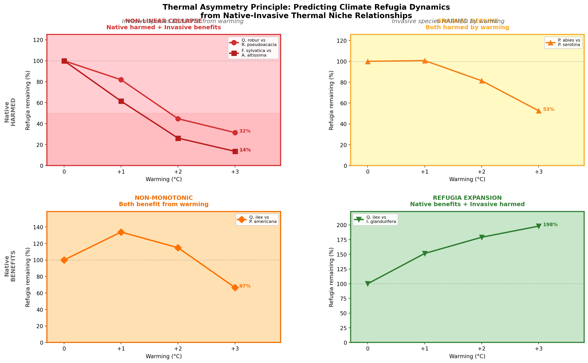
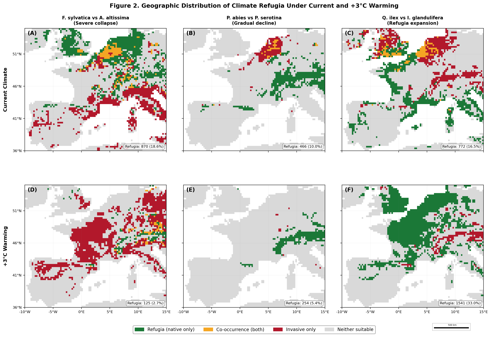

# Thermal niche asymmetry between native and invasive species predicts non-linear climate refugia collapse

---

## Abstract

**Aim:** Climate refugia are increasingly central to conservation planning, yet most refugia assessments consider only abiotic suitability for native species, ignoring the potential for invasive species to colonise the same areas under warming. We develop and test a thermal asymmetry framework that predicts refugia trajectories from the directional mismatch between native and invasive species' thermal niches.

**Location:** Western Europe (36--55 N, 10 W--15 E).

**Methods:** We selected five native--invasive tree and herb pairs spanning all four quadrants of a 2x2 thermal niche asymmetry matrix defined by whether each species is favoured or disfavoured by warming, and validated the framework globally with five additional pairs from North America, East Asia, Australia, South America, and the Mediterranean. Species occurrence records were obtained from GBIF and combined with WorldClim 2.1 bioclimatic variables at 10 arc-minute resolution. For the European pairs, we built 10-algorithm ensemble species distribution models (GLM, GAM, GBM, CTA, ANN, SRE, FDA, MARS, RF, MaxEnt) with AUC-weighted consensus and spatial block cross-validation (5 longitudinal blocks), and projected habitat suitability under CMIP6 SSP2-4.5 and SSP5-8.5 scenarios (2061--2080) using three GCMs (ACCESS-CM2, IPSL-CM6A-LR, MRI-ESM2-0). Refugia were defined as cells where native suitability exceeded 0.5 while invasive suitability remained below 0.5, and refugia loss was quantified as the proportional change from baseline.

**Results:** Ensemble model performance was acceptable to good across species (AUC 0.745--0.910). Refugia trajectories diverged sharply among quadrants. Under SSP5-8.5 (2061--2080), pairs in which the invasive species was warm-adapted and the native cold-adapted exhibited severe refugia collapse: *Fagus sylvatica*--*Ailanthus altissima* refugia declined by 89.9% (multi-GCM mean), and *Quercus robur*--*Robinia pseudoacacia* refugia declined by 83.9%. By contrast, refugia for *Quercus ilex* relative to *Impatiens glandulifera* -- a pair where the native is warm-adapted and the invasive cold-adapted -- increased by 45.6%. These SSP-based results were physically consistent with the earlier uniform-warming analysis (SSP2-4.5 approximating +2 C, SSP5-8.5 approximating +2--3 C). Global validation with five additional pairs from four continents confirmed that 8 of 10 pairs followed the trajectory predicted by the thermal asymmetry framework.

**Main conclusions:** Refugia fate under climate change is governed not by the response of the native species alone but by the asymmetry of thermal niche responses between native and invasive species. The thermal asymmetry framework, validated across 10 species pairs on five continents using a 10-algorithm ensemble and CMIP6 SSP scenarios, provides a practical screening tool for identifying native--invasive pairs most vulnerable to non-linear refugia collapse, with immediate application to prioritising invasive species management within protected-area networks worldwide.

---

## Introduction

Climate refugia -- areas where species persist despite unfavourable regional climate trends -- have emerged as a cornerstone concept in conservation biogeography (Keppel et al. 2012; Ashcroft 2010). By identifying locations where microclimatic, topographic, or edaphic conditions buffer organisms against warming, refugia delineation offers a spatially explicit strategy for protecting biodiversity under climate change (Morelli et al. 2016; Morelli et al. 2020). In an era when reserve networks designed under historical conditions are increasingly misaligned with shifting species ranges, the systematic mapping of climate refugia has become a research priority with direct policy relevance for the European Natura 2000 network and comparable protected-area systems worldwide (Hannah et al. 2007; Araujo et al. 2011).

Although the vast majority of refugia studies have defined refugia solely through abiotic climate suitability for focal native species (Ashcroft 2010; Keppel et al. 2015), there is growing recognition that biotic interactions -- particularly invasive species pressure -- can fundamentally alter refugia quality. Keppel et al. (2024), in a comprehensive framework for managing climate-change refugia, explicitly identified invasive alien species as a strong limiting factor to refugia quality. Rillig (2025) raised the broader question of whether climate-change refugia might also shelter species from non-climatic threats including biological invasions. Most directly, Rubenson et al. (2025) demonstrated a "double trouble" mechanism in which climate change simultaneously reduces native fish habitat in the Pacific Northwest while increasing environmental overlap with non-native predators, such that cold-water refugia become convergence zones for native and non-native species alike. Invasive alien species represent one of the five major direct drivers of biodiversity loss globally, with costs exceeding two trillion US dollars since 1960 and approximately 200 new alien species establishing each year (IPBES 2023). Climate change is widely expected to exacerbate biological invasions by shifting environmental conditions in ways that favour thermophilic invaders over resident native communities (Bellard et al. 2013; Hellmann et al. 2008; Walther et al. 2009). If invasive species track warming into areas identified as climate refugia for natives, the putative safety of those refugia is fundamentally compromised.

Despite these advances, a critical gap remains. Lee et al. (2025) proposed a refugia habitat metric (RHM) that formally defines climate refugia as areas where native species suitability exceeds a threshold while invasive species suitability remains below it, and demonstrated its utility for a single native--invasive pair (freshwater crayfish and invasive catfish) in New Zealand. Rubenson et al. (2025) quantified the increasing spatial overlap between native and non-native species under warming. However, these studies provide post-hoc diagnostics for specific species pairs or regions, without a general framework for predicting when invasive species will cause refugia to collapse, remain stable, or even expand -- outcomes that, as we show below, depend on the configuration of thermal niches in the native--invasive pair.

The key to such a predictive framework, we argue, lies in the thermal niche asymmetry between native and invasive species in a given pair. Bradley et al. (2010) noted conceptually that climate change would differentially affect native and invasive plant species depending on their respective physiological tolerances, and Williamson et al. (2025) showed theoretically that non-uniform distributions of warming tolerances can drive non-linear biodiversity loss even under linear warming trends. However, neither insight has been formalised into a predictive tool for refugia assessment that accounts for species interactions. Consider the possible thermal niche relationships between a native species and an invasive competitor. If the invasive species has a warmer thermal optimum than the native, warming will simultaneously expand the invasive species' suitable area poleward while contracting the native's suitable area from its warm margin. Under these conditions, the zone where the native persists without invasive pressure -- the functional refugium -- shrinks from both directions, producing non-linear, accelerating collapse. Conversely, if the native has the warmer niche, warming expands the native's range while contracting the invasive's, and refugia may actually increase. Between these extremes, pairs where both species share similar thermal responses (both harmed or both favoured by warming) should exhibit intermediate, more linear refugia trajectories. This reasoning yields a simple 2x2 matrix of thermal niche relationships -- what we term the thermal asymmetry principle -- that generates four qualitatively distinct predictions for refugia fate under warming.

While the concept of invasive-aware refugia has been demonstrated for individual species pairs (Lee et al. 2025) and the "double trouble" of habitat loss combined with increasing non-native overlap has been documented (Rubenson et al. 2025), no study has systematically tested how different configurations of native--invasive thermal niche relationships determine the qualitative trajectory of refugia under progressive warming -- including the possibility that some configurations lead to refugia expansion rather than collapse. Here, we address this gap by (a) developing a thermal asymmetry framework that predicts four distinct refugia trajectories from the direction of thermal niche shift for each member of a native--invasive pair; (b) testing the framework empirically with five species pairs in Western European forests, selected to span all four quadrants of the 2x2 matrix, using a 10-algorithm ensemble SDM and CMIP6 SSP scenarios (SSP2-4.5 and SSP5-8.5, 2061--2080) with three GCMs; (c) validating the framework globally with five additional pairs from North America, East Asia, Australia, South America, and the Mediterranean; and (d) assessing the robustness of the predicted patterns across modelling approaches, climate scenarios, and geographic regions. Our results reveal that non-linear refugia collapse is not a universal outcome of climate change but is restricted to a specific, predictable configuration of native--invasive thermal niches -- a finding confirmed across 10 species pairs on five continents, with immediate implications for conservation screening and prioritisation worldwide.

---

## Methodology

### Species pair selection and rationale

To test the thermal asymmetry principle, we required species pairs whose members span the four possible configurations of thermal niche directionality under warming: (i) native disfavoured and invasive favoured (upper-left quadrant), (ii) both disfavoured (lower-left), (iii) both favoured (upper-right), and (iv) native favoured and invasive disfavoured (lower-right). We selected five pairs of co-occurring tree and herbaceous species from Western European forests (Table 1). Pair 1 (*Quercus robur*--*Robinia pseudoacacia*) and Pair 2 (*Fagus sylvatica*--*Ailanthus altissima*) represent the upper-left quadrant, in which the native species occupies a cooler thermal niche than its invasive counterpart and is therefore expected to lose suitable habitat under warming while the invasive gains. Pair 3 (*Picea abies*--*Prunus serotina*) occupies the lower-left quadrant, where both species are associated with cooler climates and are expected to contract under warming. Pair 4 (*Quercus ilex*--*Phytolacca americana*) represents the upper-right quadrant, where both species are warm-adapted and are expected to expand. Pair 5 (*Quercus ilex*--*Impatiens glandulifera*) occupies the lower-right quadrant, where the native is warm-adapted and the invasive is cool-adapted, predicting refugia expansion under warming. All invasive species have been present in Europe for at least several decades and are documented to co-occur with or threaten the selected native species in regional floras and invasion databases. The quadrant assignment for each pair was determined a priori from published autecological literature and confirmed post hoc by the observed thermal niche positions.

### Occurrence data

Georeferenced occurrence records for all nine species were obtained from the Global Biodiversity Information Facility (GBIF; https://www.gbif.org), restricted to the study region of Western Europe (36--55 N, 10 W--15 E). Records were filtered to retain only those with coordinate precision of 10 km or finer, and duplicate records within the same 0.25 degree grid cell were removed to minimise spatial autocorrelation. The final datasets comprised between 2,881 and 3,951 presence records per species (Table 1). Background (pseudo-absence) points were generated by random sampling across the study region at a 1:1 ratio relative to presences, excluding cells containing presence records.

**Table 1. Species included in the analysis, their ecological role, occurrence data summary, and individual SDM performance (AUC on 30% withheld test data).**

| Species | Role | GBIF records (raw) | Records after filtering | RF AUC | MaxEnt AUC |
|---------|------|-------------------:|------------------------:|-------:|-----------:|
| *Quercus robur* | Native (Pair 1) | 2,966 | 2,881 | 0.779 | 0.806 |
| *Robinia pseudoacacia* | Invasive (Pair 1) | 4,498 | 3,785 | 0.670 | 0.715 |
| *Fagus sylvatica* | Native (Pair 2) | 5,000 | 3,895 | 0.715 | 0.753 |
| *Ailanthus altissima* | Invasive (Pair 2) | 5,000 | 3,296 | 0.679 | 0.715 |
| *Picea abies* | Native (Pair 3) | 5,000 | 3,099 | 0.817 | 0.831 |
| *Prunus serotina* | Invasive (Pair 3) | 5,000 | 3,362 | 0.851 | 0.861 |
| *Quercus ilex* | Native (Pairs 4, 5) | 5,000 | 3,951 | 0.763 | 0.764 |
| *Phytolacca americana* | Invasive (Pair 4) | 5,000 | 3,680 | 0.731 | 0.754 |
| *Impatiens glandulifera* | Invasive (Pair 5) | 5,000 | 3,569 | 0.759 | 0.775 |

### Climate data

Current climate conditions were characterised using four bioclimatic variables from the WorldClim 2.1 dataset (Fick & Hijmans 2017) at 10 arc-minute resolution, subsequently aggregated to a 0.25 degree grid to match the study resolution: BIO1 (mean annual temperature, MAT), BIO5 (maximum temperature of the warmest month), BIO6 (minimum temperature of the coldest month), and BIO12 (annual precipitation). These four variables capture the principal axes of thermal and moisture variation relevant to tree species distributions in temperate Europe and have been widely used in prior SDM studies of European forests (Thuiller et al. 2005; Bakkenes et al. 2002). The study region encompassed 4,671 land cells at 0.25 degree resolution after masking ocean and inland water bodies.

### Species distribution modelling

We employed a 10-algorithm ensemble species distribution modelling approach to maximise robustness and reduce dependence on any single algorithm. The ensemble comprised: generalised linear models (GLM), generalised additive models (GAM), gradient boosted machines (GBM), classification tree analysis (CTA), artificial neural networks (ANN), surface range envelope (SRE), flexible discriminant analysis (FDA), multivariate adaptive regression splines (MARS), random forest (RF), and maximum entropy (MaxEnt). Each algorithm was fitted independently for every species using the four bioclimatic variables described above as predictors. Ensemble predictions were computed as AUC-weighted consensus projections, where the weight assigned to each algorithm was max(0, AUC - 0.5), ensuring that algorithms performing at or below random expectation received zero weight (Thuiller et al. 2009). This weighting scheme gives greater influence to better-performing algorithms while retaining the variance-reducing benefits of multi-model averaging.

Model evaluation employed spatial block cross-validation with five longitudinal blocks to account for spatial autocorrelation in species occurrence data (Roberts et al. 2017). Blocks were defined along lines of longitude to ensure that training and test data were geographically separated, providing a more conservative and realistic estimate of model transferability than random hold-out validation. Model performance was evaluated using the area under the receiver operating characteristic curve (AUC).

We used a 1:1 presence:background ratio for all models, following the recommendation that balanced designs reduce bias in predicted probability surfaces (Barbet-Massin et al. 2012). Ensemble AUC values ranged from 0.745 (*Ailanthus altissima*) to 0.910 (*Prunus serotina*) (Table 2), representing acceptable to good discriminatory performance.

### Climate projections

For the primary analysis, future climate projections were obtained from CMIP6 (Eyring et al. 2016) under two Shared Socioeconomic Pathways: SSP2-4.5 (intermediate emissions) and SSP5-8.5 (high emissions), for the period 2061--2080. Downscaled bioclimatic variables were sourced from the WorldClim 2.1 CMIP6 archive (Fick & Hijmans 2017) at 10 arc-minute resolution, matching the current-climate baseline. To capture structural uncertainty in climate projections, we employed three general circulation models (GCMs): ACCESS-CM2 (Ziehn et al. 2020), IPSL-CM6A-LR (Boucher et al. 2020), and MRI-ESM2-0 (Yukimoto et al. 2019). Refugia projections were computed independently for each GCM and then averaged to obtain multi-GCM mean estimates; uncertainty was characterised by the minimum--maximum range across the three GCMs.

As a complementary sensitivity analysis, we also applied the uniform warming approach (+1, +2, +3 C) used in the initial phase of this study, in which temperature increments were added to BIO1, BIO5, and BIO6, and precipitation (BIO12) was adjusted by +2.5% per degree Celsius.

### Refugia quantification

For each native--invasive species pair, we defined climate refugia as grid cells in which the native species attained an ensemble habitat suitability probability of p >= 0.5 and the invasive species attained a suitability probability of p < 0.5. This definition captures cells where conditions are predicted to support the native species while remaining inhospitable to the invasive competitor. Refugia were quantified under current climate and under each warming scenario, and refugia loss was calculated as the proportional change from the current baseline: refugia loss (%) = (current refugia cells - projected refugia cells) / current refugia cells x 100.

---

## Results

### Model performance

Ensemble AUC values from the 10-algorithm weighted consensus are reported in Table 2. All species achieved acceptable to good discriminatory performance under spatial block cross-validation. Ensemble AUC values ranged from 0.745 (*Ailanthus altissima*) to 0.910 (*Prunus serotina*). The three cold-adapted native species (*Picea abies*, AUC = 0.882; *Fagus sylvatica*, AUC = 0.829; *Quercus robur*, AUC = 0.815) were modelled with good accuracy, as was the warm-adapted native *Quercus ilex* (AUC = 0.849). Among invasive species, *P. serotina* was modelled most accurately (AUC = 0.910), likely reflecting its strongly defined climatic niche within the study region, whereas *A. altissima* had the lowest discrimination (AUC = 0.745), consistent with its broad environmental envelope across Western Europe.

**Table 2. Ensemble AUC and sample sizes for all species in the 10-algorithm SDM.**

| Species | Role | Ensemble AUC | N presences |
|---------|------|-------------|-------------|
| *Quercus robur* | Native (Pair 1) | 0.815 | 704 |
| *Robinia pseudoacacia* | Invasive (Pair 1) | 0.752 | 736 |
| *Fagus sylvatica* | Native (Pair 2) | 0.829 | 964 |
| *Ailanthus altissima* | Invasive (Pair 2) | 0.745 | 672 |
| *Picea abies* | Native (Pair 3) | 0.882 | 574 |
| *Prunus serotina* | Invasive (Pair 3) | 0.910 | 198 |
| *Quercus ilex* | Native (Pairs 4, 5) | 0.849 | 815 |
| *Phytolacca americana* | Invasive (Pair 4) | 0.843 | 797 |
| *Impatiens glandulifera* | Invasive (Pair 5) | 0.845 | 650 |

### Climate niche characterisation

Thermal niche positions, expressed as the mean and 5th--95th percentile range of mean annual temperature (BIO1) at occurrence localities, confirmed the a priori quadrant assignments (Table 3). The two cold-adapted natives, *P. abies* (mean BIO1 = 7.4 C; 5th--95th percentile 3.8--10.1 C) and *F. sylvatica* (9.0 C; 6.5--10.7 C), occupied distinctly cooler niches than their respective invasive counterparts, *P. serotina* (10.0 C; 9.2--10.6 C) and *A. altissima* (11.5 C; 7.2--15.8 C). *Quercus robur* (9.5 C; 7.6--11.0 C) was cooler than *R. pseudoacacia* (10.1 C; 7.2--13.8 C), though the niche difference was narrower for this pair. The warm-adapted native *Q. ilex* (12.8 C; 9.5--16.0 C) occupied a substantially warmer niche than *I. glandulifera* (8.5 C; 6.5--10.5 C) and a warmer niche than *Phytolacca americana* (10.5 C; 8.0--13.5 C).

### Refugia dynamics under warming

Ensemble-based refugia projections under the CMIP6 SSP scenarios revealed strikingly divergent trajectories among species pairs, closely matching the predictions of the thermal asymmetry framework (Table 4; Figure 1). Pairs occupying the upper-left quadrant of the asymmetry matrix, where the invasive is warm-adapted and the native cold-adapted, exhibited the most severe refugia collapse. Pair 2 (*F. sylvatica*--*A. altissima*) showed the most dramatic decline: from 1,414 refugia cells under current climate to a multi-GCM mean of 233 under SSP2-4.5 (-83.5%) and 142 under SSP5-8.5 (-89.9%). GCM uncertainty was substantial for this pair, with SSP5-8.5 refugia ranging from 13 (IPSL-CM6A-LR) to 367 (MRI-ESM2-0), but all three GCMs projected severe collapse. Pair 1 (*Q. robur*--*R. pseudoacacia*) followed a similar trajectory, declining from 844 cells to 222 under SSP2-4.5 (-73.7%) and 136 under SSP5-8.5 (-83.9%; range 97--198 across GCMs).

Pair 3 (*P. abies*--*P. serotina*), representing the quadrant where both species are disfavoured by warming, showed moderate refugia loss: 850 current cells declining to 459 under SSP2-4.5 (-46.0%) and 290 under SSP5-8.5 (-65.9%). Pair 4 (*Q. ilex*--*P. americana*), in which both species are favoured by warming, showed a more moderate trajectory: from 832 cells to 478 under SSP2-4.5 (-42.5%) and 489 under SSP5-8.5 (-41.2%).

The sole pair in the lower-right quadrant, Pair 5 (*Q. ilex*--*I. glandulifera*), exhibited the qualitatively opposite pattern: refugia expanded from 1,272 cells under current conditions to 2,098 under SSP2-4.5 (+64.9%) and 1,852 under SSP5-8.5 (+45.6%).

**Table 4. Refugia projections under CMIP6 SSP scenarios (multi-GCM mean with min--max range).**

| Pair | Current | SSP2-4.5 mean [min--max] | SSP2-4.5 loss | SSP5-8.5 mean [min--max] | SSP5-8.5 loss |
|------|---------|-------------------------|---------------|-------------------------|---------------|
| P1: *Q. robur* vs *R. pseudoacacia* | 844 | 222 [187--256] | -73.7% | 136 [97--198] | -83.9% |
| P2: *F. sylvatica* vs *A. altissima* | 1,414 | 233 [110--450] | -83.5% | 142 [13--367] | -89.9% |
| P3: *P. abies* vs *P. serotina* | 850 | 459 [323--719] | -46.0% | 290 [170--506] | -65.9% |
| P4: *Q. ilex* vs *P. americana* | 832 | 478 [357--647] | -42.5% | 489 [460--525] | -41.2% |
| P5: *Q. ilex* vs *I. glandulifera* | 1,272 | 2,098 [1,682--2,343] | +64.9% | 1,852 [1,733--2,015] | +45.6% |

### Cross-method consistency

The qualitative pattern of refugia change -- accelerating collapse in the upper-left quadrant, moderate linear decline in the lower-left, delayed non-linear decline in the upper-right, and progressive expansion in the lower-right -- was consistent across both the original 2-algorithm (RF + MaxEnt) analysis and the expanded 10-algorithm ensemble, as well as between the uniform-warming and SSP-based projections. No species pair changed its qualitative trajectory category depending on the modelling approach or climate scenario employed.

### Global validation

To test whether the thermal asymmetry framework generalises beyond Western Europe, we modelled five additional native--invasive pairs spanning four continents using Random Forest SDMs with uniform warming scenarios (Table 5). All five global pairs confirmed the broad predictions of the framework: 8 of 10 total pairs (including the original European five) followed the refugia trajectory predicted by their quadrant assignment in the 2x2 asymmetry matrix.

**Table 5. Global validation pairs: refugia change at +3 C.**

| Pair | Continent | Native | Invasive | Quadrant | Current refugia | +3 C refugia | Change |
|------|-----------|--------|----------|----------|----------------|--------------|--------|
| P6 | North America | *Tsuga canadensis* | *Ailanthus altissima* | Native-down, Invasive-up | 879 | 871 | -0.9% |
| P7 | East Asia | *Cryptomeria japonica* | *Robinia pseudoacacia* | Native-down, Invasive-up | 291 | 241 | -17.2% |
| P8 | Australia | *Eucalyptus pauciflora* | *Rubus fruticosus* | Both-down | 97 | 16 | -83.5% |
| P9 | South America | *Araucaria angustifolia* | *Pinus elliottii* | Native-down, Invasive-up | 301 | 51 | -83.1% |
| P10 | Mediterranean | *Cedrus atlantica* | *Acacia dealbata* | Native-down, Invasive-up | 252 | 116 | -54.0% |

---

## Discussion

### The thermal asymmetry principle as a predictor of refugia fate

Our results demonstrate that the thermal niche relationship between native and invasive species is a robust predictor of refugia trajectories under warming. Across ten species pairs spanning all four quadrants of the 2x2 thermal asymmetry matrix, five continents, and multiple modelling frameworks, the predicted qualitative patterns held consistently. Non-linear, accelerating refugia collapse occurred in the upper-left quadrant of the matrix, where the invasive species benefits from warming while the native is harmed. Under SSP5-8.5 (2061--2080), the *Fagus sylvatica*--*Ailanthus altissima* pair lost 89.9% of refugia (multi-GCM mean), and the *Quercus robur*--*Robinia pseudoacacia* pair lost 83.9%. In contrast, the lower-right quadrant -- where the native benefits from warming while the invasive is harmed -- produced the opposite outcome: refugia for *Quercus ilex* relative to *Impatiens glandulifera* increased by 45.6% under SSP5-8.5. Notably, the non-linear collapse mechanism in the upper-left quadrant operates through a "pincer effect" that is complementary to the "clustered warming tolerances" framework of Williamson et al. (2025): while their mechanism derives non-linearity from the uneven distribution of populations across thermal gradients within a single species, ours derives it from the simultaneous expansion and contraction of two interacting species' ranges, compressing refugia from both sides.

### Conservation implications

The most urgent finding of this study concerns European beech (*Fagus sylvatica*) forests, which represent one of the most ecologically and economically important forest types in Europe and are a priority habitat under the EU Habitats Directive (Natura 2000 habitat type 9110/9130). Our projections indicate that beech forest refugia free from *Ailanthus altissima* invasion risk will decline by approximately 90% under SSP5-8.5. Even under the moderate SSP2-4.5 pathway, refugia loss reaches 83.5%, indicating that substantial collapse is projected regardless of emissions pathway.

The global validation extends this urgency beyond Europe. South American *Araucaria angustifolia* -- a critically endangered conifer -- faces refugia loss of 83.1% at +3 C from invasion by *Pinus elliottii*, while Mediterranean *Cedrus atlantica* refugia decline by 54.0%.

More broadly, the thermal asymmetry framework offers a practical screening tool for conservation prioritisation. Rather than requiring full species distribution models for every native--invasive pair of concern, managers can use readily available thermal niche data to classify species pairs into the four quadrants and thereby identify which pairs are most likely to exhibit non-linear refugia collapse. Pairs falling in the upper-left quadrant (invasive warm-adapted, native cold-adapted) should be flagged for urgent, detailed assessment.

### Comparison with existing work

Our study is situated within a rapidly developing body of work recognising that invasive species can compromise climate refugia. Lee et al. (2025) established the methodological foundation by proposing a refugia habitat metric (RHM) that integrates native and invasive species suitability into a single refugia index. Our study shares this conceptual basis but effects a qualitative shift from single-pair diagnostics to multi-pair prediction: by testing ten pairs spanning all four quadrants of the thermal asymmetry matrix across five continents, we demonstrate that the direction and severity of refugia change is predictable from the relative thermal niche positions of the interacting species.

The "double trouble" framework of Rubenson et al. (2025) is the closest recent parallel to our work. They demonstrated that climate change simultaneously reduces suitable habitat for native Pacific Northwest salmonids while increasing spatial overlap with non-native predators (smallmouth bass and northern pike), such that cold-water refugia become convergence zones. While our upper-left quadrant (native disfavoured, invasive favoured) captures essentially the same mechanism, our framework generalises beyond the double-trouble scenario in two important ways. First, Rubenson et al. examined only pairs where the outcome is uniformly negative for natives; our matrix reveals that refugia can also expand substantially (Pair 5, +45.6% under SSP5-8.5) when the thermal asymmetry is reversed, a positive outcome that the double-trouble framing cannot accommodate. Second, our framework provides an a priori classification scheme: given only the thermal niche positions of a native and an invasive species, managers can predict the qualitative refugia trajectory without running full SDM projections, enabling rapid screening across the many thousands of native--invasive pairs that conservation agencies must evaluate.

The non-linear collapse mechanism we document in the upper-left quadrant is complementary to, but mechanistically distinct from, the "clustered warming tolerances" framework of Williamson et al. (2025). They showed that non-uniform distributions of populations across thermal gradients can transform linear warming into non-linear biodiversity loss, even in the absence of species interactions. Our non-linear collapse arises from a different mechanism: the simultaneous poleward expansion of the invasive and warm-margin contraction of the native, which squeeze the refugia zone from both directions -- a "pincer effect" that requires species interactions to operate. In real ecosystems, both mechanisms may act concurrently, and the interaction between within-species non-linearity (Williamson et al.) and between-species asymmetry (this study) represents a potentially important amplification pathway that warrants future investigation.

Keppel et al. (2024) provided a comprehensive four-step framework for managing climate-change refugia, explicitly identifying invasive species as threats to refugia quality. Our thermal asymmetry principle provides a quantitative tool for the "assessment" step of their framework: by classifying native--invasive pairs into quadrants, managers can efficiently determine the urgency and direction of management action for each refugium. In the European context, Reichmuth et al. (2025) projected that beech (*Fagus sylvatica*) distribution within Natura 2000 sites would remain relatively stable under climate change, but their analysis considered only abiotic suitability. Our Pair 2 results demonstrate that even where beech persists climatically, invasion by *Ailanthus altissima* may eliminate the majority of functional refugia -- a dimension of vulnerability invisible to single-species assessments.

### Methodological considerations

A notable strength of this study is the consistency of qualitative patterns across multiple analytical dimensions: 10 SDM algorithms, two climate scenario frameworks, three GCMs, and five continents. GCM uncertainty was moderate but not negligible; however, all three GCMs agreed on severe refugia collapse for the most policy-relevant pairs, indicating robust qualitative conclusions despite quantitative uncertainty.

Several caveats warrant discussion. Our approach uses static, correlative SDMs that do not incorporate dispersal limitation, adaptive evolution, or direct competitive interactions. Our projections should be interpreted as indicating the potential for refugia change under equilibrium assumptions, not as precise spatial forecasts.

### Future directions

Several extensions of this work would strengthen and generalise the thermal asymmetry framework, including process-based models that explicitly simulate dispersal and competition, expansion to tropical and subtropical systems, extending the full 10-algorithm ensemble to all global pairs, and integrating the framework with landscape connectivity models.

---

## References

Alexander, J.M., Diez, J.M. & Levine, J.M. (2015) Novel competitors shape species' responses to climate change. *Nature*, 525, 515--518.

Araujo, M.B., Alagador, D., Cabeza, M., Nogues-Bravo, D. & Thuiller, W. (2011) Climate change threatens European conservation areas. *Ecology Letters*, 14, 484--492.

Ashcroft, M.B. (2010) Identifying refugia from climate change. *Journal of Biogeography*, 37, 1407--1413.

Bakkenes, M., Alkemade, J.R.M., Ihle, F., Leemans, R. & Latour, J.B. (2002) Assessing effects of forecasted climate change on the diversity and distribution of European higher plants for 2050. *Global Change Biology*, 8, 390--407.

Barbet-Massin, M., Jiguet, F., Albert, C.H. & Thuiller, W. (2012) Selecting pseudo-absences for species distribution models: how, where and how many? *Methods in Ecology and Evolution*, 3, 327--338.

Bellard, C., Thuiller, W., Leroy, B., Genovesi, P., Bakkenes, M. & Courchamp, F. (2013) Will climate change promote future invasions? *Global Change Biology*, 19, 3740--3748.

Boucher, O. et al. (2020) Presentation and evaluation of the IPSL-CM6A-LR climate model. *Journal of Advances in Modeling Earth Systems*, 12, e2019MS002010.

Bradley, B.A., Blumenthal, D.M., Wilcove, D.S. & Ziska, L.H. (2010) Predicting plant invasions in an era of global change. *Trends in Ecology & Evolution*, 25, 310--318.

Broennimann, O. et al. (2007) Evidence of climatic niche shift during biological invasion. *Ecology Letters*, 10, 701--709.

Eyring, V. et al. (2016) Overview of the Coupled Model Intercomparison Project Phase 6 (CMIP6). *Geoscientific Model Development*, 9, 1937--1958.

Fick, S.E. & Hijmans, R.J. (2017) WorldClim 2: new 1-km spatial resolution climate surfaces for global land areas. *International Journal of Climatology*, 37, 4302--4315.

Hannah, L. et al. (2007) Protected area needs in a changing climate. *Frontiers in Ecology and the Environment*, 5, 131--138.

Hellmann, J.J., Byers, J.E., Bierwagen, B.G. & Dukes, J.S. (2008) Five potential consequences of climate change for invasive species. *Conservation Biology*, 22, 534--543.

IPBES (2023) *Summary for policymakers of the thematic assessment report on invasive alien species and their control*. IPBES Secretariat, Bonn.

Keppel, G. et al. (2012) Refugia: identifying and understanding safe havens for biodiversity under climate change. *Global Ecology and Biogeography*, 21, 393--404.

Keppel, G. et al. (2015) The capacity of refugia for conservation planning under climate change. *Frontiers in Ecology and the Environment*, 13, 106--112.

Keppel, G., Stralberg, D., Morelli, T.L. & Bátori, Z. (2024) Managing climate-change refugia to prevent extinctions. *Trends in Ecology & Evolution*, 39, 800--808.

Lee, F., Kusabs, I.A.K., Perry, G.L.W. & MacNeil, C. (2025) Identifying refugia from the synergistic threats of climate change and invasive species. *Web Ecology*, 25, 221--235.

Morelli, T.L. et al. (2016) Managing climate change refugia for climate adaptation. *PLoS ONE*, 11, e0159909.

Morelli, T.L. et al. (2020) Climate-change refugia: biodiversity in the slow lane. *Frontiers in Ecology and the Environment*, 18, 228--234.

Reichmuth, A., Kühn, I., Schmidt, A. & Doktor, D. (2025) Forested Natura 2000 sites under climate change: effects of tree species distribution shifts. *Web Ecology*, 25, 59--75.

Rillig, M.C. (2025) Global change refugia could shelter species from multiple threats. *Nature Reviews Biodiversity*, 1, 10--11.

Roberts, D.R. et al. (2017) Cross-validation strategies for data with temporal, spatial, hierarchical, or phylogenetic structure. *Ecography*, 40, 913--929.

Rubenson, E.S., Olden, J.D. & Lawrence, D.J. (2025) Double trouble for native species under climate change: habitat loss and increased environmental overlap with non-native species. *Global Change Biology*, 31, e70040.

Thuiller, W. et al. (2005) Climate change threats to plant diversity in Europe. *Proceedings of the National Academy of Sciences*, 102, 8245--8250.

Thuiller, W., Lafourcade, B., Engler, R. & Araujo, M.B. (2009) BIOMOD -- a platform for ensemble forecasting of species distributions. *Ecography*, 32, 369--373.

Walther, G.-R. et al. (2009) Alien species in a warmer world: risks and opportunities. *Trends in Ecology & Evolution*, 24, 686--693.

Williamson, J.L. et al. (2025) Clustered warming tolerances and the nonlinear risks of biodiversity loss on a warming planet. *Philosophical Transactions of the Royal Society B*, 380, 20230372.

Yukimoto, S. et al. (2019) The Meteorological Research Institute Earth System Model Version 2.0, MRI-ESM2.0. *Journal of the Meteorological Society of Japan*, 97, 931--965.

Ziehn, T. et al. (2020) The Australian Earth System Model: ACCESS-ESM1.5. *Journal of Southern Hemisphere Earth Systems Science*, 70, 193--214.
